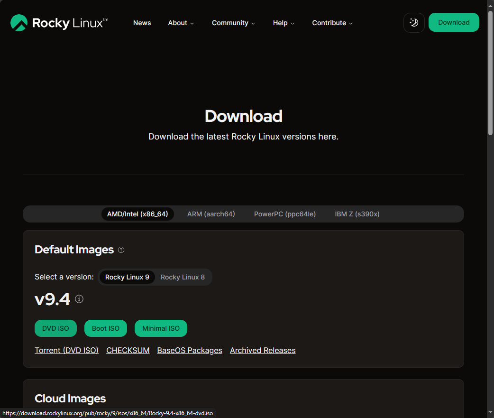
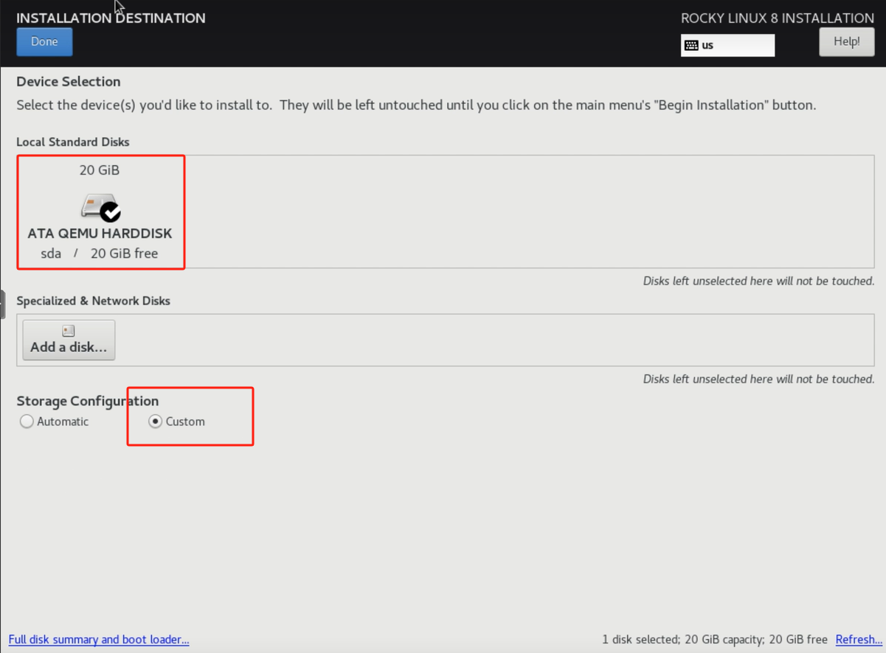
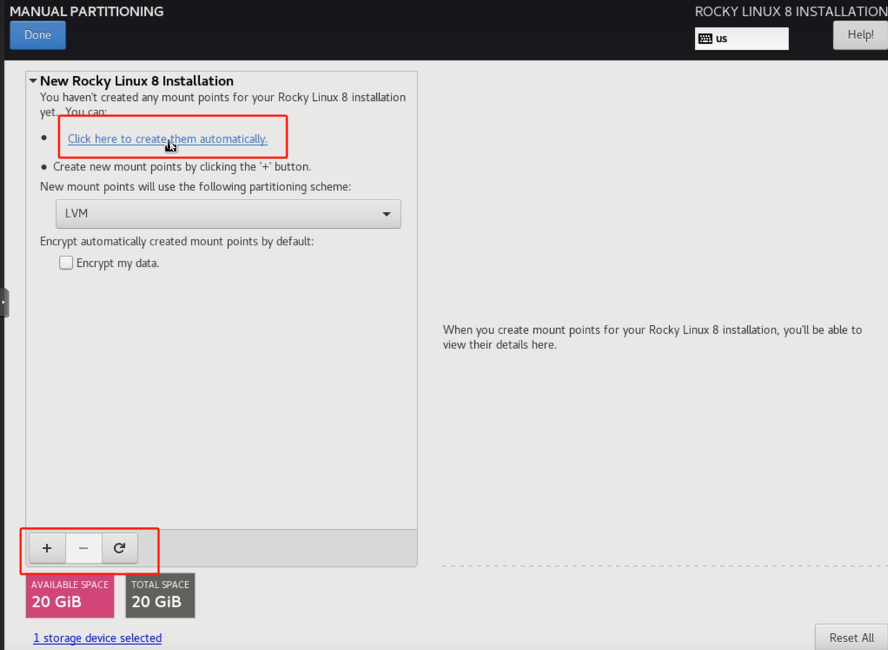

# 05/10/24

## 购买服务器

Intel:至强

AMD:EPYC

满载频率影响计算速度，单核睿频不影响

通道数 对应 内存条数（带宽影响计算速度）

## 安装Linux系统

#### 下载

<https://rockylinux.org/download>&#x20;

DVD ISO

balenaEtcher 写入U盘

bois 选择U盘启动（显示器分辨率不要超过2K，会乱码）

#### 安装

语言：English  US

时区：Asia/shanghai

安装位置：固态硬盘，自定义分区!

Click here to create them automatically

following partitioning scheme: Standard Partition

分区调正：/home 删除，/ 删除，/ 添加分配主要容量，添加/home，Accept Changes

网络：检查 ip 地址

用户设置：root 密码：jzq13506135475  （取消锁定，允许SSH登录）创建用户：jzq 密码：jzq9093105（设置为管理员）

开始安装

重启

#### 设置

打开终端

定义服务器名称

    hostname   #当前主机名称
    sudo hostnamectl hostname node01     

固定ip地址

    nmcli connection    #查看以太网链接

<!---->

    sudo nmcli connection modify <interface_name> ipv4.address <ip/prefix>
    sudo nmcli connection modify enp0s3 ipv4.address 192.168.1.101/24     # 固定网卡enp0s3到指定ip

<!---->

    sudo nmcli connection down enp0s3   # 关闭以太网
    sudo nmcli connection up enp0s3    # 启动以太网

设置本地DNS

编辑文本

    sudo vim /etc/hosts   # 编辑 hosts 文件

添加两行

    192.168.1.101 node01
    192.168.1.102 node02

退出保存

    :wq

客户端软件 Mobaxterm：Session，SSH，登录
