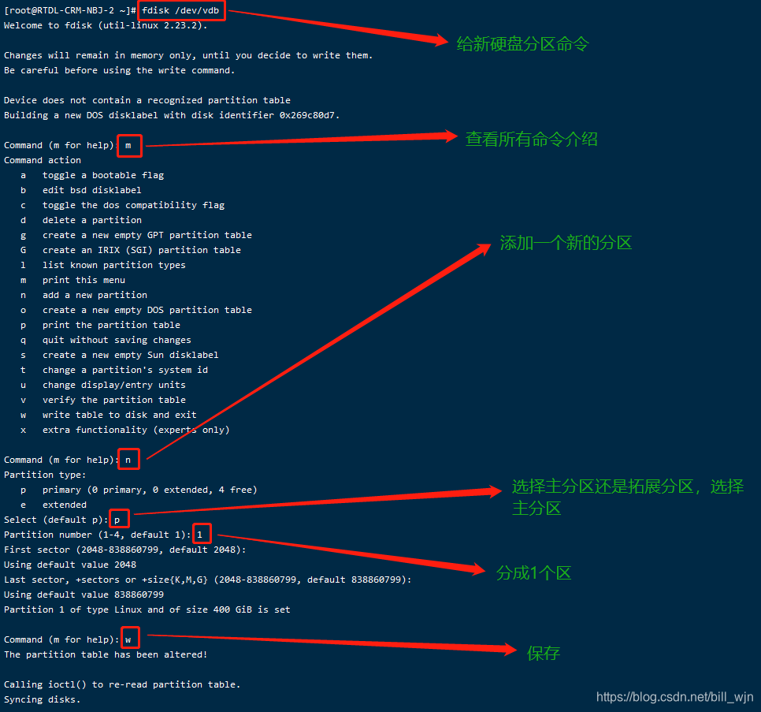
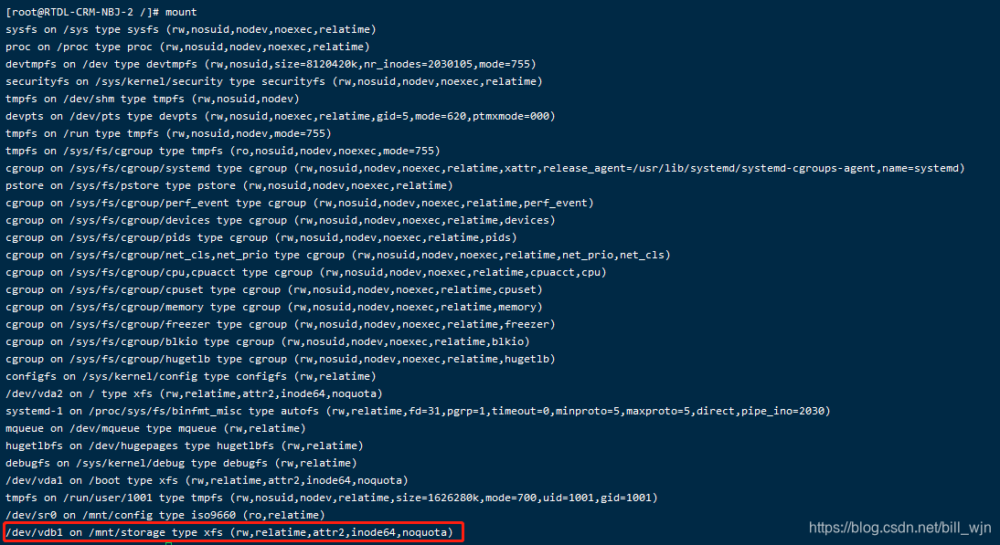
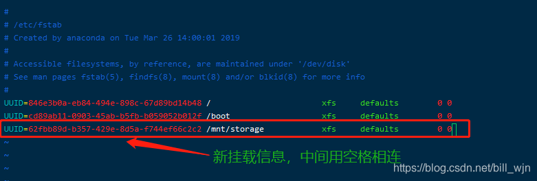
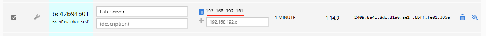
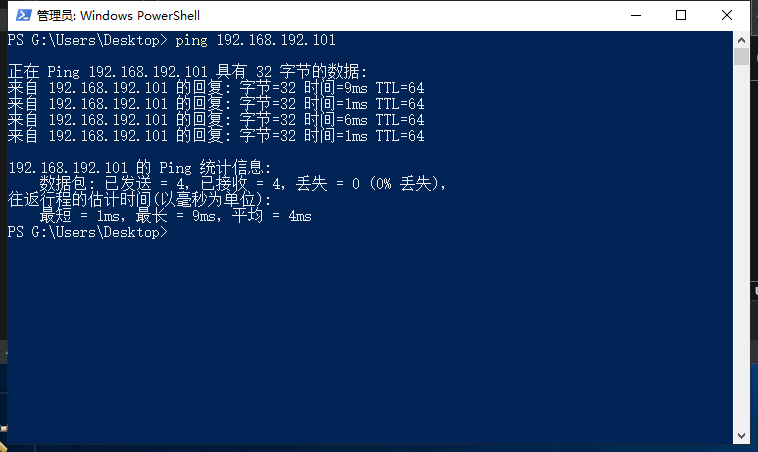

# 05/11/24

### 创建分区

```
lsblk -f     # 列出分区
sudo fdisk /dev/sdb   # 格式化分区   
m        # 帮助 m for help
g        # 创建GPT分区表 create a new empty GPT partition table
n        # 添加一个分区 add a new partition

```

Partition number (1-128, default 1): 1

回车

回车

    w     # 保存



### 组建Raid

```
sudo dnf install mdadm      # 安装 mdadm 
sudo mdadm --create --verbose /dev/md0 --level=10 --raid-devices=4 /dev/sdb1 /dev/sdc1 /dev/sdd1 /dev/sde1      # 组建软raid

```

将新组建的 raid 盘 md0 进行格式化

    sudo mkfs.xfs /dev/md0     # 格式化为 xfs
    lsblk -f                   # 查看结果

### 永久挂载到 /home

    sudo mount /dev/md0 /home   # 将md0 临时挂载 到 /home
    sudo mount    # 检验挂载结果



    lsblk -f      # 复制md0 分区的uuid
    sudo vim /etc/fstab    # 编辑fstab文件，
    :wq          # 退出保存



    sudo reboot    # 重启检查/home 分区

### 添加 epel 软件包

    sudo dnf install epel-release
    sudo dnf update
    sudo reboot

### Zerotier 内网穿透

进入 zerotier 页面<https://www.zerotier.com/download/> &#x20;

登录 服务器 ssh

    curl -s https://install.zerotier.com | sudo bash   # 下载 zerotier 
    sudo zerotier-cli join af415e486fd8f364            # 加入网络 ID
    sudo zerotier-cli listnetworks                     # 查看网段（结果）
    sudo systemctl enable zerotier-one.service         # 开机自启


需要等 5-10 延迟
用 移动热点 在 powershell 里 ping 192.168.192.101



### 挂载 /home 目录后登录 shh 出现 

`error/timeout in locking authority file /home/jzq/.Xauthority
`

因为没有给userA对于/home/jzq/的写权限，所以导致在连接时无法创建文件.Xauthority。因此，输入下面命令后重启：

```
chown jzq:jzq -R /home/jzq
usermod -s /bin/bash jzq
```
问题解决
&#x20;
