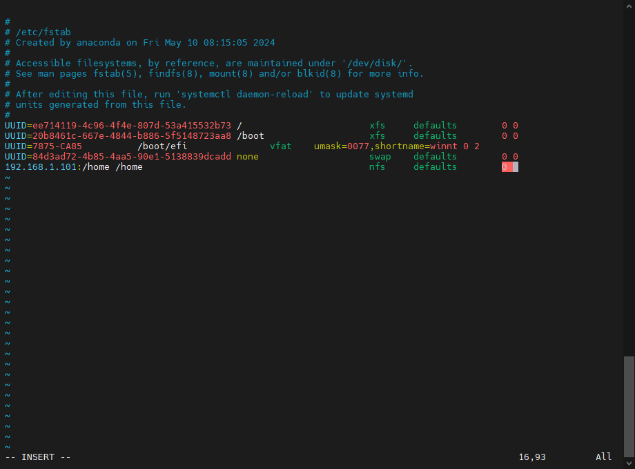

# 05-13-24-NFS-Smba
### 1. NFS 文件共享
#### 1.1 安装

服务端（node01）和客户端（node02）都需要安装
```
sudo -i     # 获取超级权限
yum install -y nfs-utils
yum install -y rpcbind
```
#### 1.2 启动
在 node01 中
```
systemctl start rpcbind    # 先启动rpc服务
systemctl enable rpcbind   # 设置开机启动
systemctl start nfs-server    
systemctl enable nfs-server

```
#### 1.3 关闭防火墙


```
systemctl  status firewalld.service      # 查看防火墙的状态
systemctl  stop firewalld.service        # 关闭防火墙
systemctl  disable firewalld.service     # 开机禁用防火墙
systemctl  is-enabled firewalld.service  # 查看防火墙是否开机启动
```
#### 1.4 配置 NFS


```
vim /etc/exports     #编辑配置文件
```
添加一行
/home 192.168.245.0/24(rw,async,no_root_squash)    # 将 home 目录挂载到 192.168.1.x 网段下
:wq 保存退出

```
systemctl reload nfs-server   # 重新加载NFS服务，使配置文件生效
showmount -e 192.168.1.101    # 查看结果
```

#### 1.5 挂载 NFS

切换到 node02 临时挂载

```
mount -t nfs 192.168.1.101:/home /home     # 将 node01 的 home 挂载到 node02 的 home 目录
```
永久挂载

```
vim /etc/fstab     #编辑文件
```


结束

### 2. Smba 文件共享

### 2.1 安装

```
yum install -y  samba
```

### 2.2 配置 smba 

```
vim /etc/samba/smb.conf     # 编辑配置文件
```
文件内容改为如下
[jzq]
    workgroup = WORKGROUP
    security = user
    passdb backend = tdbsam
    valid users = jzq
    browseable = yes
    read only = No
    path = /home/jzq
    public = yes
    writable = yes
    guest ok = no
    admin users = jzq
    valid users = jzq
    create mask = 0775
    directory mask = 0775

设置 smba 用户

```
smbpasswd -a jzq          # 添加smba 用户
New SMB password:         # 设置密码
Retype new SMB password:  # 重复密码
Added user smbuser、

systemctl restart smb     # 重启服务应用配置
systemctl restart nmb     

sudo systemctl enable smb  # 开机启动
sudo systemctl enable nmb


```
#### 2.3 关闭 selinux 


```
sudo vim /etc/selinux/config    # 编辑配置文件
```
找到 SELINUX= 这一行，并将其更改为：SELINUX=disabled

在 Windows 端，网络访问 node01，输入用户名 密码


结束 


### 3. 无密码互访 ssh

关闭服务端和客户端 selinux


```
su jzq                             # 登录用户目录
setsebool -P use_nfs_home_dirs 1   # 在共享 home 目录的情况下
ssh-keygen                         # 生成 key
ssh-copy-id node02                 # 发送 key 到客户端
```


 


