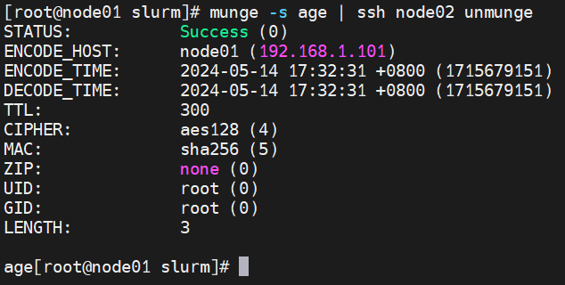
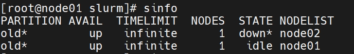
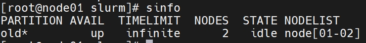
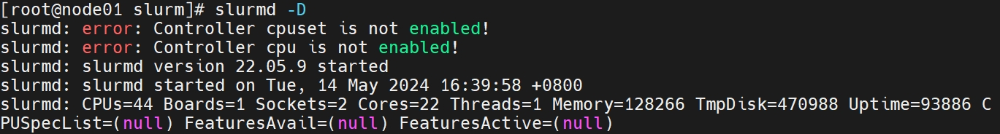
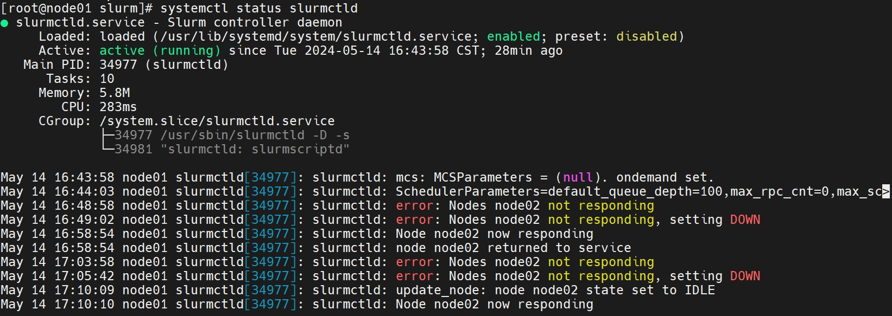
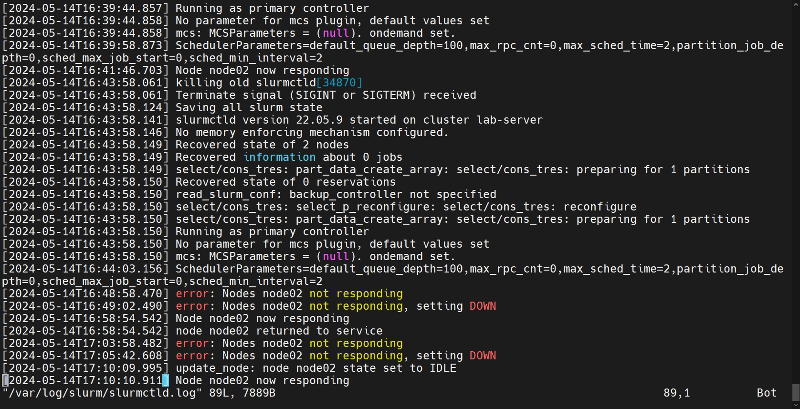

### 1. 安装配置 slurm

#### 1.1 安装 slrum

```
sudo -i
dnf install slurm          # node01（控制端） + node02（服务端）
```
#### 1.2 配置 munge（加密）

```
create-munge-key      # node01 生成密钥
scp -r /etc/munge/munge.key node02:/etc/munge/munge.key      # node01 发送密钥到 node02
chown munge:munge /etc/munge/munge.key                       # 设置权限 node01 + node 02
systemctl enable munge            # node01 + node 02
systemctl start munge             # node01 + node 02
```
查看加密结果

```
munge -s age | ssh node02 unmunge     # node01 加密字符串（age） node01 解密
```


解密成功

结束

#### 1.3 配置 slurm     


```
vim etc/slurm/slurm.conf    # slurm.conf 内容修改
```
slurm.conf 内容修改

```
ClusterName=lab-server            # 集群名称
SlurmctldHost=node01              # host 名称
MpiDefault=none                    
ProctrackType=proctrack/cgroup    # 任务处理
ReturnToService=2                 # 任务出错回到控制端时间
SlurmUser=root                    # slurm 用户
TaskPlugin=task/affinity,task/cgroup    # 控制任务分配
KillWait=5                        # 杀掉任务时间
Waittime=0                        # 等待时间
SchedulerType=sched/backfill      # 任务排队：先到先得
SelectType=select/cons_tres       # 表示基于计算资源的节点选择策略
SelectTypeParameters=CR_Core      # 按 cpu 核心数分配
AccountingStorageType=accounting_storage/none   # 用户记录
JobCompType=jobcomp/none          # 任务记录
NodeName=node01 CPUs=44 Sockets=2 CoresPerSocket=22 ThreadsPerCore=1 State=UNKNOWN      # 每台服务器信息
NodeName=node02 CPUs=44 Sockets=2 CoresPerSocket=22 ThreadsPerCore=1 State=UNKNOWN      # 每台服务器信息
# Sockets 主板 cpu 插槽数；  CoresPerSocket 每颗 cpu 核心数；  ThreadsPerCore 超线程  
PartitionName=old Nodes=node0[1-2] Default=YES MaxTime=INFINITE State=UP        # 集群信息
# PartitionName 分组名称； Nodes=node0[1-2] 当前组所含服务器； State=UP 启动当前组
```
结束

#### 1.4 运行 slurm


```
systemctl stop firewalld     # 关闭所有服务器防火墙 
```
前台试运行 slurm 查看结果

```
slurmctld -D  # node01 运行 slurm (-D 前台显示)
slurmd -D     # node02 运行 slurm (-D 前台显示)

sinfo        # 查看 slurm 状态
```

非正常      node02 dead



正常



```
systemctl start slurmctld        # 服务端 node01 启动
systemctl enable slurmctld       # 服务端 node01 启动

systemctl start slurmd      # 服务端 node02 启动
systemctl enable slurmd     # 服务端 node02 启动

systemctl status slurmctld   # 主控端 node01 查看状态
systemctl status slurmd      # 服务端 node02 查看状态
```


#### 1.5 出错分析


```
slurmctld -D      #前台跑，看问题
```



```
systemctl status slurmctld         # 看进程状态       
```



```
vim /var/log/slurm/slurmctld.log    # 控制端日志
vim /var/log/slurm/slurmd.log       # 服务端日志
```


#### 附 slurm.conf


```
ClusterName==lab-server
SlurmctldHost==node01
MpiDefault==none
ProctrackType==proctrack/cgroup
ReturnToService==2
SlurmctldPidFile==/var/run/slurm/slurmctld.pid
SlurmctldPort==6817
SlurmdPidFile==/var/run/slurm/slurmd.pid
SlurmdPort==6818
SlurmdSpoolDir==/var/spool/slurm/d
SlurmUser==root
StateSaveLocation==/var/spool/slurm/ctld
SwitchType==switch/none
TaskPlugin==task/affinity,task/cgroup
InactiveLimit==0
KillWait==5
MinJobAge==300
SlurmctldTimeout==120
SlurmdTimeout==300
Waittime==0
SchedulerType==sched/backfill
SelectType==select/cons=_tres
SelectTypeParameters==CR=_Core
AccountingStorageType==accounting=_storage/none
AccountingStoreFlags==job=_comment
JobCompType==jobcomp/none
JobAcctGatherFrequency==30
JobAcctGatherType==jobacct=_gather/none
SlurmctldDebug==info
SlurmctldLogFile==/var/log/slurm/slurmctld.log
SlurmdDebug==info
SlurmdLogFile==/var/log/slurm/slurmd.log

NodeName==node01 CPUs==44 Sockets==2 CoresPerSocket==22 ThreadsPerCore==1 State==UNKNOWN
NodeName==node02 CPUs==44 Sockets==2 CoresPerSocket==22 ThreadsPerCore==1 State==UNKNOWN
PartitionName==old Nodes==node0=[1-2] Default==YES MaxTime==INFINITE State==UP
```


