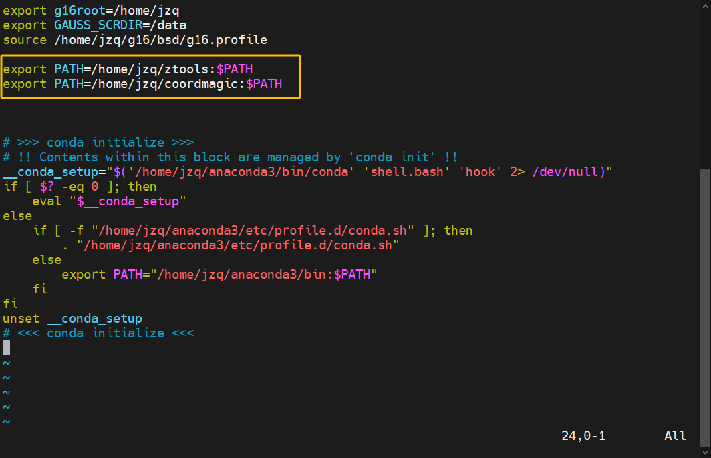

### 1. 安装 Gaussion16

#### 1.1 安装 Gaussion16

参考网站：http://sobereva.com/439

smba 上传高斯安装包 G16_C02_AVX2.tbJ
上传路径 /home/jzq  
```
cd /home/jzq                # 到安装包目录下
tar xvf G16=_C02=_AVX2.tbJ  # 解压到当前目录 （/home/jzq/）
```

#### 1.2 配置 Gaussion16

设置高速缓存文件夹 /data，所有节点必须同一文件夹位置

```
sudo -i        
mkdir /data                # node01 + node02
mkdir /home/data           # node01 
ln -s /home/data /data     # node01 将 raid10 链接到 data 
vim /etc/fstab             # node02 将高速磁盘 md1(raid0) 挂载到 /data
chmod 777 /data            # node01 + node02 设置文件夹权限为 777
```


```
sudo vim /home/jzq/.bashrc           # 编辑用户配置文件
source /home/jzq/.bashrc             # 加载用户配置文件
```
添加下面内容

```
export g16root==/home/jzq        # g09root 环境变量用来说明 Gaussian 目录被放在了哪个目录下
export GAUSS=_SCRDIR==/data      # GAUSS=_SCRDIR 环境变量用来说明哪个文件夹作为临时文件夹
source /home/jzq/g16/bsd/g16.profile      # source 命令用来执行 Gaussian 自带的脚本文件，其中包含了各种配置 Gaussian 运行环境的命令
```
编辑 Gaussion16 默认文件

```
vim /home/jzq/g16/Default.Route    # 如果没有就会新建文件
```
添加下面内容

```
-M- 120GB      # 默认使用内存=
-P- 44         # 默认使用核心
```

#### 1.3 配置权限

Gaussion16 是具有商业版权软件，必须要设置 750 权限

```
cd /home/sob/g16/         # 切换到/home/sob/g16/目录
chmod 750 -R *            # 对当前目录下所有文件和所有子目录下的文件都设置权限
```
### 2. 安装 Anaconda

Anaconda 就是可以便捷获取包且对包能够进行管理，
包括了 python 和很多常见的软件库和一个包管理器 conda。
常见的科学计算类的库都包含在里面了，
使得安装比常规 python 安装要容易，同时对环境可以统一管理的发行版本。

参考网站 https://blog.csdn.net/wyf2017/article/details/118676765

#### 2.1 下载 Anaconda

通过网络下载
```
wget https://repo.anaconda.com/archive/Anaconda3-2024.02-1-Linux-x86_64.sh
```
电脑下载，通过 smba 上传 Anaconda3-2024.02-1-Linux-x86_64.sh

#### 2.2 安装

```
chmod +x Anaconda3-2024.02-1-Linux-x86=_64.sh    # 设置权限
./Anaconda3-2024.02-1-Linux-x86=_64.sh           # 安装运行
```

### 3. 安装 GaussView 6.0

激活密钥 V64128473351848W-5826N

### 4. 安装 Materials Studio

装载 Materials_Studio_2023_Win_x64.ISO

安装后将 ISO 下 \Medicine\msi2023.lic 复制到桌面
编辑 msi2023.lic ，将 this_host 改为计算机名称
选择 Install License 并浏览并选择 .lic

### 5. 提交作业

#### 5.1 单晶文件转 gjf 文件

.cif 拖入 Materials Studio 2023
选择原子，右键 Select Fragment
Ctrl+C 复制，New 3D Atom 新窗口 Ctrl+C 粘贴
删除多余原子
对单双键进行计算，选择全部分子原子：Build - Bonds - Calculate
Export 为 mol2 文件
用 Guassion View 转换为 gjf 文件

#### 5.2 修改 gjf 表头命令

以 dbt.gjf 文件为例
```
%chk=dbt.chk         # 与 dbt.gjf 文件命相同
%nproc=44            # CPU 核数
%mem=100GB           # 内存
# PBE1PBE def2svp g09default opt em(gd3bj) scrf(solvent=diphenylether) geom(connectivity)   # opt 优化范用命令
```
保存

#### 5.3 提交任务

创建文件夹 /home/jzq/wy/150524
上传 dft.gjf 

编辑 run.sbatch

```
#!/bin/bash
#SBATCH -o job.%j.out
#SBATCH -J po              # 文件名称
#SBATCH --nodes=1          # 选择节点数
#SBATCH --ntasks-per-node=1 # 任务分配节点
#SBATCH --cpus-per-task=44 # 选择内存核数


source ~/.bashrc           # 重新加载环境变量

g16 po.gjf                 # 使用高斯16 运行
```
输入 sbatch run.sbatch 提交任务
输入 squeue 查看任务计算信息
输入 top 查看进程

#### 5.4 批量提交任务

下载 钟成老师 仓库文件（批处理工具）
git clone https://gitee.com/coordmagic/coordmagic.git

编辑环境变量

```
vim ~/.bashrc
```


添加两行
```
export PATH=/home/jzq/ztools:$PATH
export PATH=/home/jzq/coordmagic:$PATH
```



```
qcinp.py  -h        # 查看帮助信息
qcinp.py -P opt -n 44 -a "scrf(solvent=diphenylether)"  *.gjf     # 统一修改表头信息
g16s *.gjf          # 统一提交
```

#### 5.5 结果查看


``` 
cd /home/jzq/wy/150524    # 到任务文件夹
grep Done *.log           # 抓取 优化步数，优化一步 Done 一次
grep Done *.log | wc -l   # 计算行数（次数）
```


