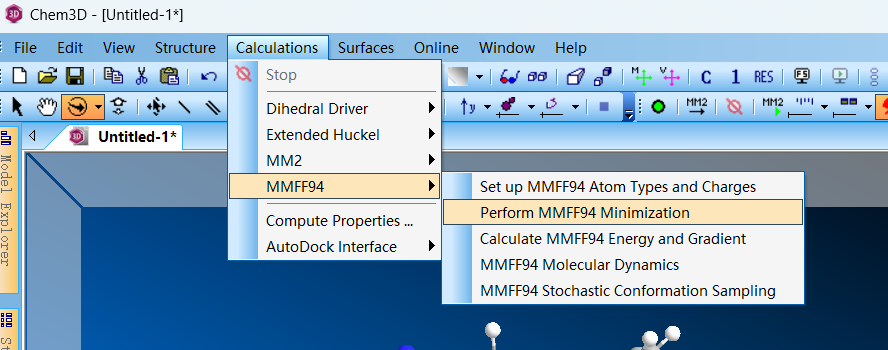
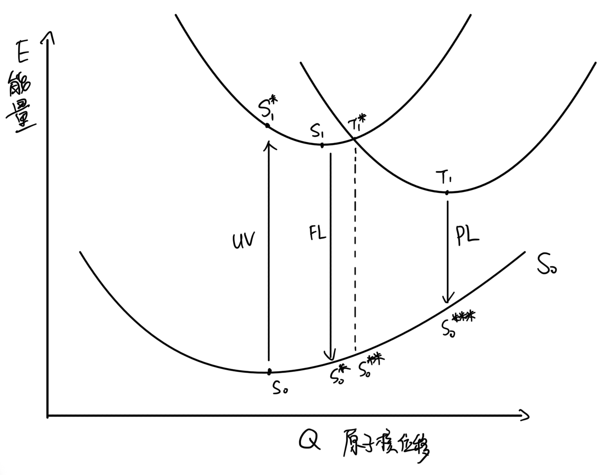

### 1. 激发态计算 
#### 1.1 激发态分类

1. 垂直激发态：相对于基态（opt）构型保持不变（并未发生 振动弛豫/重组，计算关键词：td ）;
2. 绝热激发态：由于 振动弛豫/重组 相对于基态发生构型变化 （由高能级激发态转到激发态的最低能级，计算关键词：opt-td）;
3. 同理，s1 构型下的 s0 基态 与 绝热激发态的构型相同，发生重组后又会回到开始的基态构型;
> 同理，三重态分为 垂直激发态 和 绝热激发态 ，又会产生对应的 基态构型，
> 这些构型之间可以通过 振动弛豫/重组 转换到低能级的基态构型 

> 势能面是一个范围，曲线表示概率最大的位置

> 电子跃迁只能是垂直的（相对于原子核速度很快），电子运动是水平的。所以电子从 S 态跃迁到 T 态只能从势能面的交叉点发生能量守恒的跃迁（放热时间很慢）


#### 1.2 绝热激发态计算

须在基态构型优化结果下进行计算

```
cd /home/jzq/yhy/051524          # 到计算目录文件夹下
qcinp.py -a td -A _tdopt *.log   # 将 .log 文件转化为 .gjf 文件，并添加计算激发态关键词 td （ -a td ），文件名添加后缀 _tdopt（-A _tdopt）
mkdir tdopt                      # 新建下级目录 tdopt
mv *_tdopt.gjf tdopt/            # 将新的 *_tdopt.gjf 文件移动到新文件夹下
cd tdopt/                        # 到新文件夹下
head *_tdopt.gjf                 # 查看 .gjf 表头
g16s *.gjf                       # 批量提交任务
```
#### 1.3 垂直激发态计算

须在基态构型优化结果下进行计算

删除优化命令（opt），添加激发态命令（td）

一并计算 SOC ，没有优化命令，计算较快

```
cd /home/jzq/yhy/051524                  # 到计算目录文件夹下
qcinp.py -a td -r opt -A _tdvert *.log   # 将 .log 文件转化为 .gjf 文件，并添加计算激发态关键词 td （ -a td ）删除优化关键词 opt （-r opt），文件名添加后缀 _tdvert（-A _tdvert）
mkdir td_vert                            # 新建下级目录 tdvert
mv *_tdvert.gjf td_vert/                 # 将新的 *_tdvert.gjf 文件移动到新文件夹下
cd td_vert/                              # 到新文件夹下         
qcinp.py -P soc *.gjf                    # 添加计算 SOC 的模板关键词
vim TSSQ_tdvert.gjf                      # 查看 .gjf 表头
g16s *.gjf                               # 批量提交任务
```

### 2. 定义新命令

```
vim ~/.basharc
alias sq='squeue -o "%8i %20j %4C %3t %30R %M %Z"'   # 定义 sq 为新命令，代替 squeue 且更高级
alias si='sinfo -N -o "%10N %15C %10O %10e %T"'      # 定义 si 为新命令，代替 sinfo 且更高级
source ~/.bashrc
```
### 3. 用 Chemdraw 转高斯文件

1. chemdraw 绘制分子
2. 拷贝到 Chem3D ，然后计算构型
3. 导出为 .mol2 文件
4. 用高斯将 .mol2 转化为 .gjf 文件

Chem3D 计算构型方式



#### 4. 计算 $ΔE_{st}$ 的几种方式

根据势能面示意图



分子收到光子激发，电子运动方式为：

荧光 $S_0 \to S_1^* \to S_1 \to S_0^* \to S_0$

磷光 $S_0 \to S_1^* \to S_1 \to T_0^* \to T_1 \to S_0^{***} \to S_0$             

$ΔE_{st}$ 的定义（绝对值）  $S_1- T_1$

使用低温光谱测量$ΔE_{st}$ （相对值） $(S_1-S_0^*)-(T_1-S_0^{***})$


|    $ΔE_{st}$  计算方式  | $S_1$($S_1-S_0$) | $S_1^*$ | $S_1-S_0^*$ | 
|------------------------|---------|-------|-------------|
|   $T_1$  ($T_1-S_0$)  | $ΔE_{st}$绝对值|       | （低温）荧光 |  
|  $T_1^*$              |         |      |             |   
| $T_1-S_0^{***}$       | 低温磷光 |       |$ΔE_{st}$相对值| 


