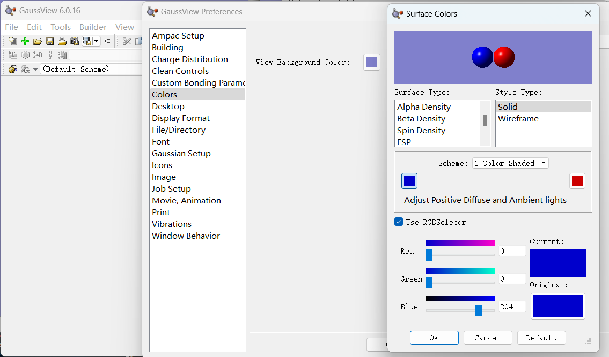
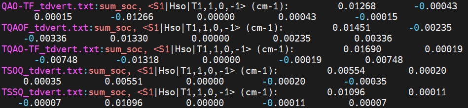

### 1. 读能级

Linux 计算的 .chk 文件为二进制文件，放在 Windows 电脑要经过转化
```
for i in *.chk; do formchk $i; done    # 将 .chk 转为 .fchk
```

方式一：
用 GaussView 打开 .cube 文件，右键 tools - MOs
查看轨道能级能量，单位 hartree
转化为 eV ，乘以 27.2114


方式二：下载钟老师仓库脚本

```
git clone https://gitee.com/coordmagic/vmwfn.git     # 克隆仓库
cd vmwfn/                                            # 到下载的仓库文件夹下
ls                                                   # 查看可执行权限（绿色）
vim ~/.bashrc                                        # 将下载文件夹路径添加为环境变量
source ~/.bashrc
```
脚本安装结束

用脚本查看能级
```
cd ~/yhy/051524/           # 到计算文件夹下
tmwfn.py -o h1-l1 *.log    # 查看 HOMO-LUMO 能级 
```
结束

### 2. 绘制轨道图


```
cd ~/yhy/051524/                                        # 到计算文件夹下
cubegen 0 mo=homo,lumo QAO-TF.fchk QAO-TF.cube 0 h      # 利用 cubgen 命令生成 .cube 绘图文件

for i in *.fchk; do cubegen 0 mo=homo,lumo $i ${i/.fchk/}.cube 0 h; done       # 利用循环命令批量导出 .cube 文件
```

用 GaussView 打开 .cube 文件，
右键 - Results - Surface - New Surface


绘制 HOMO - LUMO 轨道图

修改颜色

File - Preference - Couor - Surface Color



### 3.  计算分子 SOC

#### 3.1 从仓库安装 SOC

```
cd ~/software                                                 # 到软件目录下
git clone https://gitee.com/alpharay18953964293/pysoc.git     # 下载执行文件
cd /home/jzq/software/sob_PySOC_MolSOC/pysoc/bin              # 到执行文件目录下
ls                                                            # 查看可执行文件
export PATH=/home/jzq/software/sob_PySOC_MolSOC/pysoc/bin:$PATH    # 临时添加环境变量
which pysoc.py                                                     # 查看添加结果
update_pysoc.sh                                                    # 配置 SOC 文件
vim ~/.bashrc                                                      # 永久添加环境变量
export PATH=/home/jzq/software/sob_PySOC_MolSOC/pysoc/bin:$PATH    # 添加内容
```
#### 3.2 计算 SOC

```
cd /home/jzq/yhy/20240515/td_vert/                                 # 到计算目录下
calcsoc -s 3 -t 3 TQAOF_tdvert.log                                 # 查看计算结果                    
calcsoc -s 1 -t 1 TQAOF_tdvert.log > TQAOF_tdvert——soc.txt              # 将理算结果导入到 .txt 文件中
for i in *.log; do calcsoc -s 1 -t 1 $i > ${i/.log/}_soc.txt; done      # 批量执行
grep 'sum_soc, <S1|Hso|T1,1,0,-1>' *.txt                                # 抓取计算结果
```
取冒号后的第一位数字



#### 3.3 上传 Gitee 仓库

将钟老师编译好的 pysoc 包上传到仓库

```
cd ~/software                          
git clone https://gitee.com/alpharay18953964293/pysoc.git      # 克隆仓库
git add -A                                                     # 添加
git status                                                     # 查看状态
git commit -m pysoc                                            # 提交 pysoc 
git config --global user.name '葛世杰'                          # 仓库信息
git config --global user.email '2091816477@qq.com'             # 仓库信息 
git push                                                       # 推送仓库
```


### 4. 空穴电子分布

#### 4.1 安装 Multiwfn

安装参考网站 http://sobereva.com/688

##### 4.1.1 安装 motif 库


```
sudo yum install motif
```
##### 4.1.2 检查SysV共享内存段

当 Multiwfn 做一些较耗内存的分析、载入较大波函数文件时会崩溃。需要增大SysV共享内存段
```
sudo vim /etc/sysctl.conf

kernel.shmmax = 2000000000     # 添加内容
```
##### 4.1.3 下载 Multiwfn

下载网站 http://sobereva.com/multiwfn/

选择 Linux 64bit: Multiwfn_3.8_dev_bin_Linux.zip （版本号会发生变化）

上传安装包到  /home/jzq/software/

解压后的目录是 /home/jzq/software/Multiwfn_[版本号]_bin_Linux/，在里面应当可以看到Multiwfn程序的各种文件

##### 4.1.4 配置~/.bashrc文件


```
vim ~/.bashrc
```
添加环境变量
```
ulimit -s unlimited
export OMP_STACKSIZE=200M
export Multiwfnpath=/home/jzq/software/Multiwfn_[版本号]_bin_Linux
export PATH=/home/jzq/software/Multiwfn_[版本号]_bin_Linux:$PATH
```

##### 4.1.5 增加可执行权限


```
chmod +x /home/jzq/software/Multiwfn_[版本号]_bin_Linux/Multiwfn
```
##### 4.1.6 配置settings.ini

编辑 Multiwfn 目录下的 settings.ini，搜索 nthreads，将之数值改为计算时要用的并行核数，通常设为CPU的物理核心数即可
formchkpath：定义的是Gaussian目录下的formchk程序的路径
gaupath ：设成了Gaussian的可执行文件的路径
```
nthreads = 40
formchkpath= "/home/jzq/g16/formchk"
gaupath= "/home/jzq/g16/g16"
```
##### 4.1.7 测试

退出终端（关闭终端窗口，或者断开链接），然后重新进入终端，之后直接输入Multiwfn

若从smba服务中解压Multiwfn，则所有者为root用户，需要改所有者才能运行

```
cd /home/jzq/software/
sudo chown -R jzq Multiwfn_3.8_dev_bin_Linux/
```

如果你是通过纯文本界面连接远程 Linux 服务器并在上面执行 Multiwfn 的普通版，并且发现启动 Multiwfn 时会短暂卡住，在~/.bashrc文件末尾加入 export DISPLAY=":0" 可以避免

结束

#### 4.2 用 Multiwfn 生成电子-空穴分布

参考网站 http://sobereva.com/434

```
cd ~/yhy/20240515/td_vert/
Multiwfn TQAOF_tdvert.chk    # 首先载入含有参考态波函数信息的文件

18                # 电子激发分析
1                 # 空穴-电子分析
TQAOF_tdvert.log  # Gaussian输出文件，里面含有空穴-电子分析需要的组态系数信息
1                 # 对应 status ，首先我们分析基态(S0)到第1激发态(S1)的电子激发特征
1                 # 考察空穴、电子等函数的图形及各种指数
3                 # 高等质量格点
10                # 输出空穴 .cube
1                 # Totally 输出
11                # 输出电子 .cube
1                 # Totally 输出
# 根据屏幕代码提示选择
```

使用脚本生成 .cube 文件
```
conda develop ~/software/coordmagic
MCubeGen.py -h
MCubeGen.py -e s1,t1:hole,ele *.chk
for i in *.chk; do formchk $i; done
MCubeGen.py -e s1,t1:hole,ele *.fchk
cd MCUBEG/
cd VCUBE/
vim renderall.sh
```


