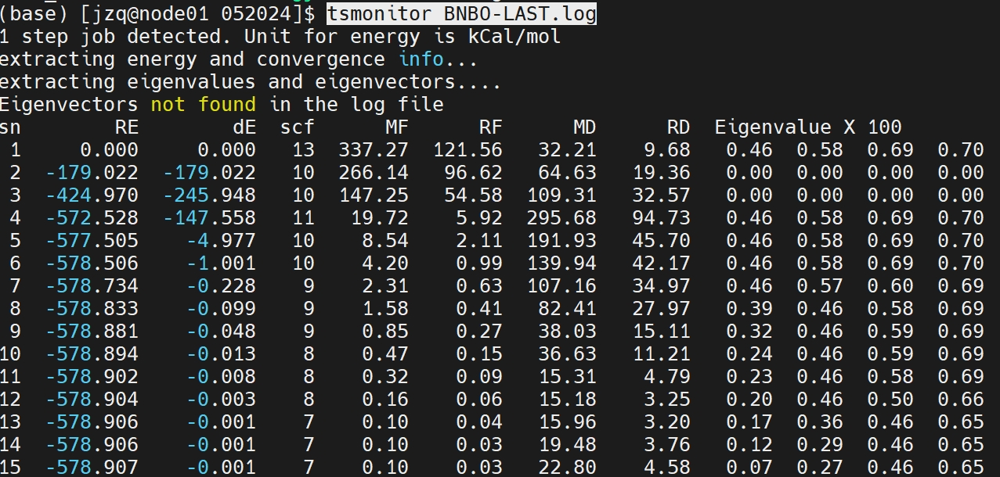

### 1. 将 VMD 渲染的 png 组图

```
MFigComp.py -h                                                                               # 脚本帮助
ls *.png                                                                                     # 列出所有图片
rm preview.png                                                                               # 删除不相关的图片
MFigComp.py -c 2  -s _ *.png                                                                 # 这里输入引用文本两列图片，以 - 分隔符分组
MFigComp.py -c 2  -s _ --clabel S1,T1 *.png                                                  # 设置列标号,用逗号分隔,多行使用 
MFigComp.py -c 2  -s _ --clabel S1,T1 -t r:4,5,2,1,3   *.png                                 # 转换行的顺序
MFigComp.py -c 2  -s _ --clabel S1,T1 -t r:4,5,2,1,3  -o test.jpg *.png                      # 生成图片
MFigComp.py -c 2  -s _ --clabel S1,T1 -t r:4,5,2,1,3  -o test.jpg  --lsize 20 *.png          # 调整表头字号
MFigComp.py -c 2  -s _ --clabel S1,T1 -t r:4,5,2,1,3  -o test.jpg  --lsize 10 -w 1c *.png    # 设置图像宽度
```

### 2. 安装 orca 

#### 2.1 安装 openmpi411
参考网站 > https://zwiss.fun/2023/06/27/%E3%80%90linux%E3%80%91rocky-linux-9-2-%E6%89%8B%E5%86%8C-openmpi/

不能修稿默认安装路径，只能在所有计算节点上安装（node01234）
```
sudo dnf install openmpi openmpi-devel
vim ~/.bashrc

export PATH=/usr/lib64/openmpi/bin:$PATH
export LD_LIBRARY_PATH=/usr/lib64/openmpi/lib:$LD_LIBRARY_PATH
source ~/.bashrc
```

在终端中执行以下命令，验证OpenMPI是否安装成功
```
mpirun --version
```
OpenMPI需要在多台计算机之间进行通信。如果您只是在单台计算机上使用OpenMPI，可以使用以下命令测试OpenMPI是否正常工作
```
mpirun -np 4 hostname
```


#### 2.2 安装 orca_5_0_4_linux_x86-64_shared_openmpi411.tar

参考网站 > http://bbs.keinsci.com/thread-11697-1-1.html
下载 orca_5_0_3_linux_x86-64_shared_openmpi411.tar.xz。
然后用  tar -xf orca_5_0_3_linux_x86-64_shared_openmpi411.tar.xz

#### 2.3 安装 orca 脚本

重新拉取库
git clone  https://gitee.com/alpharay18953964293/ztools.git

vim software/ztools/orcas
删除模块管理

（检查有无环境变量）将ztools添加到环境变量

#### 2.4 提交 orca 任务
```
qcinp.py -P oopt TSSQ.log           # 优化基态

qcinp.py -P otddh TSSQ_tdvert.log   # 计算激发态
orcas TSSQ_tdvert.inp               # 用脚本提交 inp 文件
```
从 .out 结果中找出重组能
搜索 > EXCITED STATES (SINGLETS) 和 EXCITED STATES (TRIPLETS)

若用 cc2 计算，参考下面文章

使用mrcc进行CC2/ADC(2)/双杂化TD-DFT级别的激发态计算
http://bbs.keinsci.com/thread-29156-1-1.html
(出处: 计算化学公社)


### 3. 通过 .fchk 生成 den,esp 图片


```
MCubeGen.py -c den,esp *.fchk
```

### 4. 监控反应优化进程


```
git clone https://gitee.com/coordmagic/tsmonitor.git
cd sofware/tsmonitor/
chmod +x tsmonitor
vim ~/.bashrc

cd /wjr/052014/
tsmonitor BNBO-LAST.log
```


RE,dE 能量，MF,RF,MD,RD，收敛值都小于1即可认为优化完全


