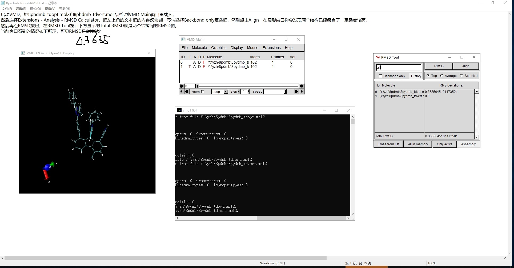

### 1. 重组能计算

#### 1.1 重组能计算原理

态@构型

eg. s1@s0 垂直激发态； s1@s1 绝热激发态

1. s1到s0下的重组能 s1@s0-s1@s1 + (s0@s1-s0@s0)
2. s1到t1下的重组能 s1@t1-s1@s1  + (t1@s1-t1@t1) 
3. 阳离子和 中性电子重组能c@n-c@c + n@c-n@n

#### 1.2 计算脚本


```
cd ~/yhy/051624/tdopt                                         # 到计算绝热激发态文件夹下 s1@s1
``` 
vim reorg  编写循环脚本
```                                     
while [ $# -ge 1 ];do                                         # 设计循环
s0s0=$(awk '/Done/{print $5}' $1 | head -n 1)                 # 取第一步 s0@s0 能量；Done 为基态能量                       
s0s1=$(awk '/Done/{print $5}' $1 | tail -n 1)                 # 取最后一步 s0@s1 能量
s1s1=$(awk '/Total Energy/{print $5}' $1 | tail -n 1)         # 取第一步 s1@s0 能量；Total Energy 为激发态能量（总能量）
s1s0=$(awk '/Total Energy/{print $5}' $1 | head -n 1)         # 取最后一步 s1@s1 能量
reorg=`echo "($s0s1 - $s0s0 + $s1s0 - $s1s1) *27.2114" | bc`  # 计算公式
printf "%-20s %20.6f\n" ${1/.log/} $reorg                     # 格式打印输出
shift
done                                                          # 结束
```
mv reorg ~/software/ztools  自动成为环境变量

### 2. 生成 静电势图


```
cd ~/yhy/051624/tdvert
MCubeGen.py -c den,esp *.fchk   # 生成 _den.cub 和 _esp.cub
```
用 Windows 中的 VMD 命令绘制图片

在cmd中打开VMD依次输入一下命令

```
vcube *_den.cub
vcube *_den.cub map *_esp.cub
vcscale BWG
vmscale -0.02 0.05
```
显示图例


锁定示图，按t，然后拖动 图例
```
vshowalways 2               # 永久显示图例
```
### 3. TSCT 分析


```
启动 Multiwfn，然后依次输入
8pydmb_tdopt.fchk  //在本文的文件包里
18  //电子激发分析
8  //使用IFCT方法分析电子转移。若要用Hirshfeld划分就选2
1  //Mulliken-like方式计算空穴和电子的分布
8pydmb_tdopt.out  //上述TDDFT任务的输出文件，在本文的文件包里
此时屏幕上提示Multiwfn检测出当前.out文件里有5个激发态的信息，问你分析哪个。作为例子，这里分析第2激发态，这是个电荷转移激发态。在Multiwfn里继续输入：
1  //分析基态到第2个激发态跃迁时的电子转移
4  //定义4个片段。这一步如果输入0，说明从外部文本文件里读取片段设定

在GaussianView里选择片段，查看序号

1 三嗪    1-2,4,10-11,19,25,28,32-33,42-45,49-50,63-72,83-84,93-102
2 三苯胺  3,7,12,15-16,18,20-21,23-24,26-27,29-30,38-41,47-48,57-60,75-80,89-90
3 吡啶    5,46,61-62,73-74,81-82,91-92
4  芴桥  6,8-9,14,17,22,31,34-37,51-56,85-88
Contribution of each fragment to hole and electron:
  1  Hole:   1.16 %     Electron:  96.84 %
  2  Hole:  94.08 %     Electron:   1.50 %
  3  Hole:   0.74 %     Electron:   0.00 %
  4  Hole:   3.65 %     Electron:   1.63 %
 Construction of interfragment charger-transfer matrix has finished!

 Variation of population number of fragment  1:   0.95328
 Variation of population number of fragment  2:  -0.92566
 Variation of population number of fragment  3:  -0.00739
 Variation of population number of fragment  4:  -0.02023

 Intrafragment electron redistribution of fragment  1:   0.01125
 Intrafragment electron redistribution of fragment  2:   0.01414
 Intrafragment electron redistribution of fragment  3:   0.00000
 Intrafragment electron redistribution of fragment  4:   0.00060

 Transferred electrons between fragments:
  1 ->  2:   0.00017       1 <-  2:   0.91108     Net  1 ->  2:  -0.91091
  1 ->  3:   0.00000       1 <-  3:   0.00719     Net  1 ->  3:  -0.00719
  1 ->  4:   0.00019       1 <-  4:   0.03537     Net  1 ->  4:  -0.03518
  2 ->  3:   0.00004       2 <-  3:   0.00011     Net  2 ->  3:  -0.00008
  2 ->  4:   0.01537       2 <-  4:   0.00055     Net  2 ->  4:   0.01482
  3 ->  4:   0.00012       3 <-  4:   0.00000     Net  3 ->  4:   0.00012

 Intrinsic charge transfer percentage, CT(%):     97.020 %
 Intrinsic local excitation percentage, LE(%):     2.599 %

```

### 4. RMSD 计算

启动VMD，把8phdmb_tdopt.mol2和8phdmb_tdvert.mol2都拖到VMD Main窗口里载入。

然后选择Extensions - Analysis - RMSD Calculator，把左上角的文本框的内容改为all，取消选择Backbond only复选框，然后点击

Align，在图形窗口你会发现两个结构已经叠合了，重叠度较高。

然后再点RMSD按钮，在RMSD Tool窗口下方显示的Total RMSD就是两个结构间的RMSD值。

当前窗口看到的情况如下所示，可见RMSD是0.3635埃




### 5. 轨道离域分析 ODI 值

```
我们再用Hirshfeld方法计算一下这个轨道的ODI值。依次输入
启动 Multiwfn 然后输入
8  // 轨道成分分析
1  // 我们首先用Mulliken方法算ODI
52  // 假设考察的是第52号轨道
在输出信息的末尾会看到ODI值：
Orbital delocalization index:   44.28

作为例子，我们再用Hirshfeld方法计算一下这个轨道的ODI值。依次输入
0  // 返回
8  // Hirshfeld轨道成分分析
1  // 使用内置的原子球对称化的密度
52  // 分析52号轨道
会发现Hirshfeld方法算的ODI值为38.93


启动Multiwfn然后输入
examples\excit\D-pi-A.fchk
8  // 轨道成分分析
8  // Hirshfeld方法
1  // 使用内置的原子球对称化的密度
-5  // 对一批轨道计算ODI
1-56  // 占据轨道的序号范围

很快得到相应数据
```


