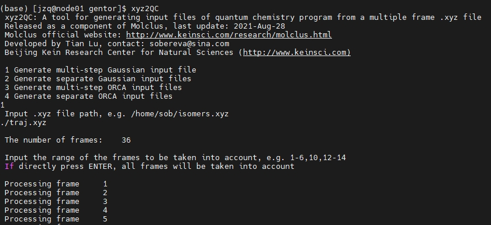

### 1. 定义三新个命令

#### 1.1 查看 Gaussian 任务
```
alias tkf='grep Normal *.log'                                                          # 查看是否正常结束
alias tkd='for i in *.log; do echo "$i: $(grep -c 'Done' "$i") steps"; done'           # 查看循环步数
alias tksm='for i in *.log; do echo -e "\n$i:\n$(tsmonitor "$i" | tail -n 5)\n"; done' # 查看循环过程是否收敛，是否正常结束
```
最后一个 tksm 命令比 tkd 更加详细，但需要钟老师脚本 tsmonitor 作为环境变量


#### 1.2 查看 Orca 任务

```
alias tkof='grep NORMALLY $(find . -name "*.out" ! -name "slurm-*")'      # 查看是否正常结束
```

### 2. TSCT 计算 跃迁密度 和 空穴电子重叠

1. 注册计算化学公社账户

2. 下载钟老师帖子脚本（文末），地址> http://bbs.keinsci.com/forum.php?mod=viewthread&tid=18597&highlight=tsct

3. 把脚本加入ztools路径（环境变量）当中，并用chmod+x增加可执行权限

4.找到给体，受体，以及桥连基团片段的编号，可以参考这个视频利用gview方便地提取选定区域的原子序号。

5.在激发态计算的fchk和log文件的目录下输入


```
tstb -m td -n 1 -g 3 -b 7-9,17-24 XXX.fchk XXX.log

-m    选项选分析方法，默认的是td（基于跃迁密度的分析），还可以选he（基于空穴电子重叠的分析），ifct（基于片段间电荷转移的分析）
-n     选激发态的序号，默认是1
-g     选Multiwfn产生cube时用的格点，默认是3
-b     设定桥连片段的原子编号（这个没有默认，必须设）
-d     设定给体片段的原子编号（只有用ifct方法时才设）
-a     设定受体片段的原子编号（只有用ifct方法时才需要设）
```
以 8pydmb_tdopt 为例，计算结果为
```

tstb -m td -n 1 -g 3 -b 6,8-9,14,17,22,31,34-37,51-56,85-88  8pydmb_tdopt.fchk 8pydmb_tdopt.log

 TS/TB using transition density:
Through Space CT: 0.21236    97.23%
Through Bond  CT: 0.00604    2.76%

tstb -m he -n 1 -g 3 -b 6,8-9,14,17,22,31,34-37,51-56,85-88  8pydmb_tdopt.fchk 8pydmb_tdopt.log

TS/TB using hole-electron overlap:
Through Space CT: 0.14956    97.23%
Through Bond  CT: 0.00426    2.76%
Tot h-e  overlap: 0.15382

```

### 3. 势能面扫描

#### 3.1 简单二面角扫描

用 GaussView 把优化后的结构保存为 8pydmb-scan.gjf文件，在保存的界面里记得把 Write Cartesians 复选框取消掉，以内坐标方式记录

表头更改为

```
#p scan nosymm geom=connectivity def2svp emp=gd3bj g09default pbe1pbe        # scan nosymm 为势能面扫描关键词
```
查看原子序号，使二面角 81 46 22 17 四个原子序号组成的二面角（D78）旋转 18 次，每次旋转 10 °


将末尾 D78 一行添加 18 10. 


凡是程序需要读入浮点数的地方，绝对不能写成整数，因此此例步长必须写10.或者10.0而不能写10

把 8pydmb-scan.out拖到 GaussView 里，在窗口左上角可以看到帧号。当前扫描18步，初始结构也算一个结构，因此一共19帧，第一帧对应输入文件里的结构。

选择Results - Scan，可以看到扫描过程的能量变化，如下图所示。点击其中一个点，图形窗口就会切换到相应的帧。在窗口下方可以看到这个点对应的能量和被扫描的坐标的当前值。


这个角的话，发现 46 和 22 虽然都转动了，而其它原子并没有跟着它俩的转动而转动，因此随着扫描的进行结构愈发扭曲，完全违背我们的意愿。

#### 3.2 使用 gentor 结合 Gaussian 做二面角的刚性扫描

对于这种绕着键旋转的刚性扫描，需要借助 sob 老师开发的 molclus 程序包里的 gentor 子程序实现

安装：下载 molclus 程序，sudo chmod +x * 设置可执行程序。 

它可以按照要求对某个键依次进行旋转，并将产生的结构依次写入到 traj.xyz 文件里，之后再用 xyz2QC 转化成 Gaussian 输入文件，计算后提取所有能量就可以作图

使用 gentor 前需要先把当前结构转化成.xyz文件。最简单的方法就是直接把 8pydmb-scan.out.gjf载入 GaussView，保存成笛卡尔坐标的形式的 gjf，然后手动把此文件改写成下面的样子，第一行是原子数，第二行是注释（内容随意），然后把此文件保存为 mol.xyz


把mol.xyz放到molclus目录下的gentor目录下，并把自带的gentor.ini改写为下面这样：
```
2-12           # 原子序号 2-12，绕着 2-12 键旋转360度，产生 36 个构象
e10            # 每次转 10°
```
运行 gentor 


结构输出在了当前目录下的traj.xyz中。将此文件载入VMD播放一下，会看到下面的动画


用xyz2QC工具将traj.xyz转化成含多任务的单一Gaussian输入文件Gaussian.gjf，为省时间计算级别还是用粗糙的 PM6-D3

先将原来分子的 gjf 文件名改为 template.gjf 放在 tarj.xyz 文件夹中

启动 xyz2QC ,选 1 再填入 ./traj.xyz 再回车默认生成所有片段



即可生成所有构型的 gjf 文件

按照之前的步骤把能量取出来，并且把每个点对应的二面角数值附上去，用 Origin 作图即可