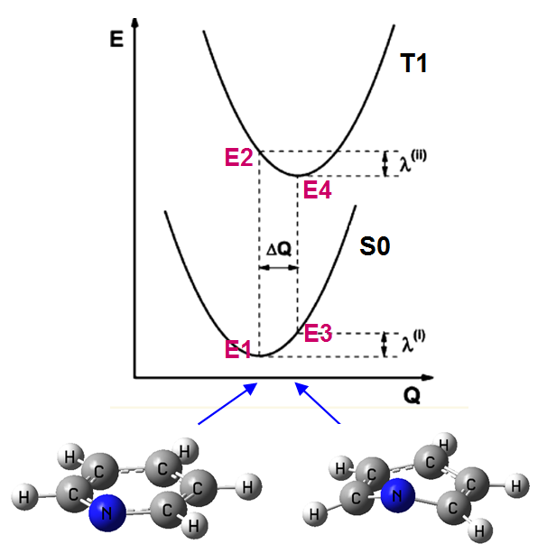
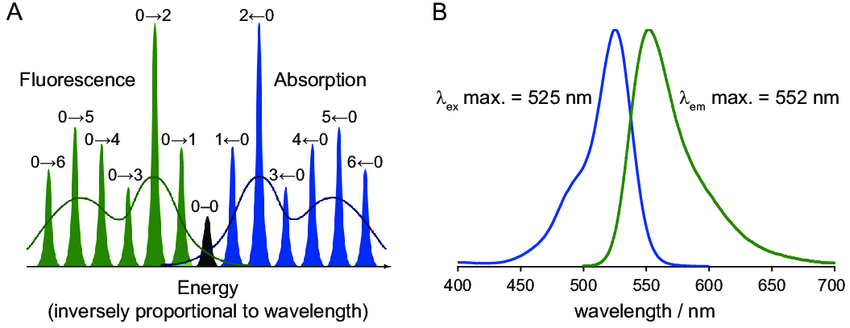
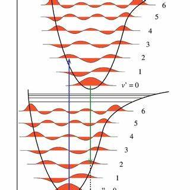
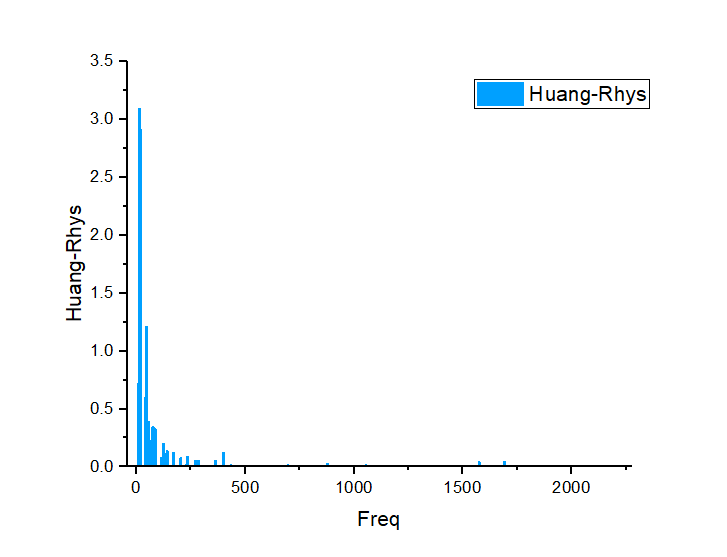

### 1. 使用 Dushin 分解重组能

参考网站 [http://sobereva.com/330](http://sobereva.com/330)
#### 1.1 安装

Dushin 下载连接 [下载连接](http://bbs.keinsci.com/forum.php?mod=attachment&aid=NDY5Nnw4M2FiOTliM3wxNzE2OTQ1Mzc5fDYzNTEzfDM0MDc%3D)

解压到 software/Dushin 文件夹下，添加环境变量

#### 1.2 使用

将 Gaussian 16 计算的 s0 opt freq 和 s1 opt freq 的 log 文件 cp 到 freq 文件夹下面
> 计算时用的关键词是 #P freq b3lyp/def2svp，注意必须用#P，而且P必须大写，否则dushin无法正确识别其中的信息。算完后把.chk用formchk转换为同名的.fch文件，也放在当前目录下。
设 Gaussian 的计算输出文件为 S0_freq.out 和 S1_tdopt_freq.out

添加 dushin.dat 文件，编辑内容为

```
1 2                            # 默认
.                              # 默认，当前文件夹

2 1 'S0 freq' 'S0_freq.out'                # 'S0 freq' Dushin 的输出文件，'S0_freq.out' Dushin 输入文件
0 1 'S1 tdopt freq' 'S1_tdopt_freq.out'    # 'S1 freq' Dushin 的输出文件，'S1_tdopt_freq.out' Dushin 输入文件
```
cd 到当前文件夹,输入 dushin 开始计算

dushin 程序会在当前目录产生一大堆输出文件，主要有用的就这两个：

dushin.out：包含主要输出信息的文件。
1. 其中 Dushinsky matrix, ncs 2 in terms of ncs 1下面输出的是第二个输入文件的正则坐标(normal coordinates, ncs)是怎么由第一个输入文件的正则坐标组合而成的，包括组合系数和贡献百分比，只有贡献较大的会被输出。
2. 下面还会输出 Dushinsky matrix, ncs 1 in terms of ncs 2，是描述第一个输入文件的正则坐标怎么由第二个输入文件的正则坐标组合而成的。再往下是Displacement: in terms of nc of 1 THEN of nc of 2，前几列是把位移和重组能按照第一个输入文件中的正则模式分解的结果，后几列是按照第二个输入文件的正则模式分解的结果。Q是指位移在此正则坐标上的分量，lam 是每个正则模式对重组能的贡献量λ_i(cm^-1)。
3. 末尾total reorg energy (cm**-1, kcal/mol)就是∑λ_i，前两个值单位是cm^-1，分别是第一个和第二个输入文件的正则坐标对重组能贡献的加和，后两个值只不过是把单位换成了kcal/mol。

supplem.dat：包含了被计算的体系的正则坐标、频率，Duschinsky矩阵，各正则模式对位移和重组能的贡献（eV）。其实和 dushin.out 差不多，只不过输出格式、单位变了变。

#### 1.3 数据处理,计算 Huang-Rhys 因子

将 dushin.out 中末尾的数据导入到 origin 中


将两列数据导入到 x , y 坐标中,然后添加一列,输入公式,计算 Huang-Rhys 因子（默认是状态2，末态的频率）
```
col(B)/219474.6363*2625500/6.02214179E23 / (col(A)*2.99792458E10*6.6260696E-34)
```
然后得到 origin 作图效果如下


> 由于 Dushin 为 16 年发行,只支持 Gaussian 09 及旧的基组,所以采用更新的 FCclasses 程序计算 Huang-Rhys 因子和振动分辨光谱

### 2. 理解 分子振动,Huang-Rhys 因子,Franck Condon 因子

#### 2.1 分子振动

在 Gaussian 16 中含有 opt freq 关键词会计算优化构型的各种振动方式,将计算的 log 文件用 Gaussian view 打开,在 result - vibration 可查看不同的振动方式.


Frequency 和 Infrared 与红外光谱中的 横纵坐标 相对应,其中高频(3000 cm-1)为 C-H 单键的伸缩振动,(1600 cm-1)双键的伸缩振动等等,再往低频可有键的夹角,分子片段的二面角的摆动 (红外光谱的指纹区)

 

当分子激发到达 E2 ,然后发生重组到达 E4 ,E2 和 E4 的构型不同,振动方式不同,不同的振动方式对重组的贡献不同,通过某些正则模式的振动可以让分子从构型 1 (E2) 转到构型 2 (E4) .重组能的贡献 λ_i 高 的振动方式对重组的贡献是最大的 (见 Dushin 部分).
> 某些振动模式也是偏离平面的扭曲模式，但从振动模式上明显会发现它并不会对 E2-E4 间结构变化产生任何贡献，所以对重组能的贡献也为 0

#### 2.2 Huang-Rhys 因子

Dushin 程序并不直接输出 Huang-Rhys 因子，自己简单算一下即可。第i个振动模式对应的 Huang-Rhys 因子为 S_i=λ_i/(h*ν_i)，这个量是无量纲的。计算时应先把振动模式对重组能的贡献 λ_i 转换为以 J 为单位，振动频率 ν_i 转换为以 s^-1 为单位。比如 S0 的 427 cm^-1 模式的 λ_i=3607.6 cm^-1，它对应的 Huang-Rhys 因子即为 
`3607.6/219474.6363*2625500/6.02214179E23 / (427*2.99792458E10*6.6260696E-34)=8.45`。这里分子部分先从cm^-1转为 Hartree 再转为 J/mol 再转为 J

> 声子 (Phonon) 是晶格振动的量子化表现

> 零声子线（Zero-Phonon Line）对应的是在电子跃迁过程中，电子从一个电子态跃迁到另一个电子态时，晶格结构保持不变的跃迁过程.(在电子激发过程中，分子构型不变，不会发生重组，没有斯托克斯位移)

> 在光谱中，除了零声子线之外，还会出现伴随声子的跃迁，称为声子边带（Phonon Sidebands）。这些边带是由于电子跃迁过程中伴随了一个或多个声子的吸收或发射而产生的.

零声子线强度通常用 Huang-Rhys因子（S）来定量化描述。
1. 电子-声子耦合强度：Huang-Rhys 因子衡量电子在不同电子态之间跃迁时，伴随着晶格振动（声子）发生的改变。S值越大，表示电子-声子耦合越强，电子跃迁过程中伴随的声子变化越显著。
2. 光谱带宽：在光吸收和发射光谱中，Huang-Rhys 因子与带宽有直接关系。S值大的材料，其光谱线会更宽，因为强耦合意味着更多的声子参与到跃迁过程中，导致更多的能级分裂和光谱展宽
3. 零声子线和声子边带的比率：零声子线（ZPL）是指电子跃迁过程中不伴随任何声子变化的直接跃迁线。Huang-Rhys因子可以用来描述零声子线与声子边带（伴随声子变化的跃迁线）的强度比率。具体来说，零声子线的强度与声子边带的强度之比是 $e^{-S}$
4. 激发态与基态势能面的位移：Huang-Rhys 因子还可以反映出激发态与基态之间的核位移。S 值越大，表示激发态与基态的势能面在核坐标上的位移越大

desmos 公式演示 [链接](https://www.desmos.com/calculator)


示意图：零声子线强度（0 → 0）声子边带（0 → 4、5、6...）

> 有机发光二极管（OLED）：在 OLED 材料中，Huang-Rhys 因子可以帮助理解发光效率和光谱特性。较低的S值通常意味着更窄的发射光谱和较高的零声子线强度，从而提高发光效率.

#### 2.3 Franck Condon 因子



利用 Huang-Rhys 因子，可以计算振动态跃迁对应的 Franck Condon 因子，结合振动能级的改变量，做 Lorentzian 展宽，就可以获得振动分辨的电子光谱

### 3. FCclasses 程序

#### 3.1 安装 FCclasses 程序

下载:进入官网,下拉,填写个人单位邮箱等信息,然后下载链接会发送到邮箱中
[下载地址](https://nextcloud.area.fi.cnr.it/index.php/s/ZrWCgwSCwb8f94z)

解压到 software 文件夹下面

```
source /opt/intel/oneapi/setvars.sh                                   # （临时）加载 Intel 编译器
./configure --with-mkl --prefix=/home/jzq/software/fcclasses3-3.0.3   # 配置安装(路径)
make            # 安装
make install    # 安装
cd bin/         # 查看安装目录下的执行文件,并添加到环境变量
```
安装结束

#### 3.2 使用 FCclasses 计算 Huang-Rhys 因子

查看使用手册 (FCclasses3_man.pdf) 如何计算 [手册下载链接](http://nextcloud.area.fi.cnr.it/index.php/s/YAJc9WCY78g7Mt7)
```
source /opt/intel/oneapi/setvars.sh    # 需要 Intel 环境变量，否则会出现下面错误
# gen_fcc_state: error while loading shared libraries: libmkl_intel_lp64.so.2: cannot open shared object file: No such file or directory

cd ~/lrh/052424/freq/                  # 到计算文件夹下（使用 tdopt 计算 freq 或者优化后的结构算 单点的 freq）
for i in *.chk; do formchk $i; done    # 转换成 fchk 文件
gen_fcc_state -i DMB_freq.fchk         # 生成 s0 态的 fcc 文件
gen_fcc_state -i DMB_tdopt_freq.fchk   # 生成 s1 态的 fcc 文件
ls *.fcc                               # 查看 fcc 文件
gen_fcc_dipfile -i DMB_tdopt_freq.fchk # 生成生成偶极子文件
mv eldip_DMB_tdopt_freq_fchk eldip_DMB # 重命名

fcclasses3 -h > fcclasses.inp          # 生成计算配置文件 见文末
vim fcclasses.inp                      # 编辑
fcclasses3 fcclasses.inp               # 提交计算

# 以下为计算的结果

vim HuangRhys.dat                      # 生成的 HuangRhys 因子
vim Clas_spectrum_Boltzmann_bin.dat
vim Clas_spectrum_Boltzmann_shape.dat
vim duschinsky.dat
vim displacement.dat
vim spec_Int_TD.dat

```
将 Gaussian view 中将状态 1 的 vibration 的表格中 Freq 复制到 origin 中做 x（fcclasses 默认对状态1的振动进行分解），HuangRhys.dat中的数据做 y 作图有：


#### 3.3 Fcclasses3 计算 IC 速率常数

使用 基态 和 激发态 tdopt 的 fchk 文件
```
gen_fcc_state -i DFBP-CZDB_freq.fchk
gen_fcc_dipfile -i DFBP-CZDB_tdopt_freq.fchk -nac
gen_fcc_state -i DFBP-CZDB_tdopt_freq.fchk
```
生成 fcc.inp 的模板文件
```
$$$
PROPERTY     =   IC  ; OPA/EMI/ECD/CPL/RR/TPA/TPCD/MCD/IC/NRSC
MODEL        =   AH   ; AS/ASF/AH/VG/VGF/VH
TEMP         =   298.0 ; (temperature in K)
BROADFUN     =   GAU  ; GAU/LOR/VOI
HWHM         =   0.01 ; (broadening width in eV)
METHOD       =   TD   ; TI/TD
;VIBRATIONAL ANALYSIS
COORDS       =   CARTESIAN ; CARTESIAN/INTERNAL
;INPUT DATA FILES
STATE1_FILE  =   DFBP-CZDB_tdopt_freq.fcc     ; 修改
STATE2_FILE  =   DFBP-CZDB_freq.fcc           ; 修改
NAC_FILE   =   nac_DFBP-CZDB_tdopt_freq_fchk  ; 修改
;VERBOSE LEVEL
VERBOSE      =   1
```
在 fcc.out 文件中


附： 提交 Fcclasses3 的模板文件
```
$$$
PROPERTY     =   OPA  ; OPA/EMI/ECD/CPL/RR/TPA/TPCD/MCD/IC/NRSC
MODEL        =   AH   ; AS/ASF/AH/VG/VGF/VH
DIPOLE       =   FC   ; FC/HTi/HTf
TEMP         =   0.00 ; (temperature in K) 
;DE           = (read) ; (adiabatic/vertical energy in eV. By default, read from state files) 
BROADFUN     =   GAU  ; GAU/LOR/VOI
HWHM         =   0.01 ; (broadening width in eV)
METHOD       =   TD   ; TI/TD
;VIBRATIONAL ANALYSIS 
NORMALMODES  =   COMPUTE   ; COMPUTE/READ/IMPLICIT
COORDS       =   CARTESIAN ; CARTESIAN/INTERNAL
;INPUT DATA FILES 
STATE1_FILE  =   DMB_s0.fcc    ; 状态 1 的 fcc 文件
STATE2_FILE  =   DMB_s1.fcc    ; 状态 2 的 fcc 文件
ELDIP_FILE   =   eldip_DMB
```


