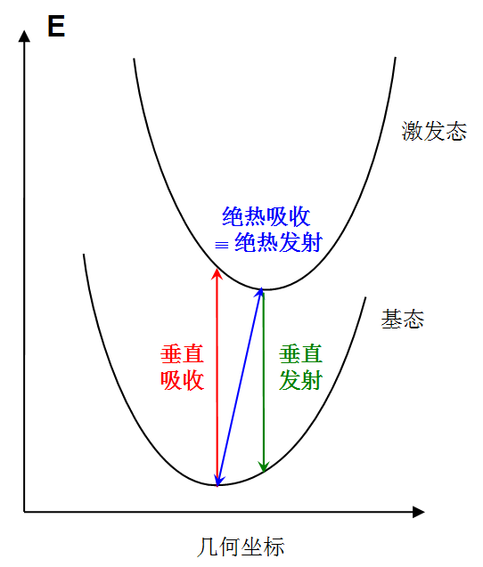

### 调控计算方法

#### 1. 溶剂化效应

参考网站 [Gaussian中用TDDFT计算激发态和吸收、荧光、磷光光谱的方法](http://sobereva.com/314)

考虑非平衡溶剂(neq)效应只是对垂直吸收、发射过程而言的，优化过程中应当使用平衡溶剂(eq)，因为随着溶质结构的变化溶剂的朝向会同步变化。

TDDFT级别下，隐式溶剂模型的溶剂场对激发态的响应有不同考虑方式。常用的有两种：
1. 线性响应(Linear response, LR)：是SCRF关键词默认的。溶剂对激发能的修正量是跃迁密度与跃迁密度导致的溶剂极化之间的相互作用。这种处理比较常用，相比气相计算不会额外带来太多耗时。
2. 态特定(State-specific, SS)：令溶剂直接对指定的激发态的密度进行响应，通过反复迭代令溶剂场与激发态密度间完全自洽。每次迭代都要做电子激发计算求出激发态密度，因而也称外迭代(External iteration)。这将使计算耗时增加一个数量级，还使得TDDFT失去解析梯度。因此仅当对结果要求精确的时候使用，且一般不用在优化激发态的过程中。而且一次只能考虑一个激发态，难以获得同时涉及很多态的吸收光谱。一般来说，除非考察的是电荷转移激发态，否则昂贵、麻烦的SS实际上并不比LR有多大优势，甚至还可能结果更差。

溶质会使溶剂分子被极化，包括溶剂的电子结构被极化以及分子朝向被极化，分别对应于溶剂弛豫的快部分和慢部分。对于处于某个电子态的体系，若溶剂的两部分都已经对其弛豫了，称为平衡溶剂(eq)；如果只是快部分弛豫了，称为非平衡溶剂(neq)。垂直吸收、垂直发射的过程非常短暂，末态时溶剂分子只有其电子部分来得及被重新极化，而朝向来不及被重新极化还停留在初态的状况，因此初态计算时应处于平衡溶剂下，而末态计算时应处于非平衡溶剂下。绝热吸收/发射过程则可认为在初态和末态时溶剂都已完全弛豫，即都处在平衡溶剂下。在溶剂中计算吸收/发射能严格来说应当考虑非平衡溶剂效应（尽管是否考虑影响不很大）


原理上说，用态特定方法，同时考虑非平衡溶剂效应，得到的激发能是最准确的，但也最耗时、繁琐，Gaussian手册上那个“7步”例子之所以搞得那么麻烦，就是因为用了这种方式考虑溶剂，而且从吸收到发射算了一个完整来回，于是把初学者们搞晕了。如果不要求那么高，用线性响应模型其实就够了，由于误差抵消之类因素，也不一定比态特定的结果差，还省了大量时间。

产生输入   计算  提取结果

快有3种（LR+cLR+SS)
慢有2种（基态溶剂壳+激发态溶剂壳）

> td 里的常用选项有下
1. nstates=N：表明总共算能量最低的N个激发态的信息，如激发能、跃迁电/磁偶极矩、振子强度、组态系数等。默认为3。
2. root=i：选择感兴趣的态。如果当前任务是与某个激发态有关的，比如几何优化、振动分析、获得偶极矩等，则表明是对第i个激发态做的。只是计算激发态信息则不需要管此设定。默认为1。
3. singlet：要求计算的N个激发态都为单重态，此为默认。
4. triplet：要求计算的N个激发态都为三重态。
50-50：要求同时计算N个单重态和N个三重态。

产生输入
```
0 opt s0 + td(50-50)                                            # 无溶剂化效应
qcinp.py --steps "td(50-50,nstates=5) PBE1PBE def2svp g09default geom=allcheck guess=read" -A _n00 DMB.log

1 opt s0 + td(50-50) scrf                                       # 溶剂化基态 + 溶剂化激发态电子响应（LR）
qcinp.py --steps "td(50-50,nstates=5) PBE1PBE def2svp g09default scrf(solvent=diphenylether) geom=allcheck guess=read" -A _n01 DMB.log

2 opt s0 + td(50-50) density scrf                               # 溶剂化第一激发态/溶剂化原子,线性响应
qcinp.py --steps "td(50-50,nstates=5) PBE1PBE def2svp g09default scrf(solvent=diphenylether) density geom=allcheck guess=read" -A _n02 DMB.log

3 opt s0 + td(50-50) density scrf(correctedLR)                  # 溶剂化第一激激发态/溶剂化原子,矫正的线性响应（CLR）
qcinp.py --steps "td(50-50,nstates=5) PBE1PBE def2svp g09default scrf(solvent=diphenylether,correctedLR)  geom=allcheck guess=read" -A _n03 DMB.log

4 opt s0 + td(50-50) density scrf(ExternalIteration)            # 溶剂化第一激激发态/溶剂化原子,态特定电子响应（SS），默认指定态为1（ROOT=1）
qcinp.py --steps "td(50-50,nstates=5) PBE1PBE def2svp g09default scrf(solvent=diphenylether,externaliteration) density geom=allcheck guess=read" -A _n04 DMB.log

5 opt s0 + td(50-50) scrf(ExternalIteration)                    #溶剂化第一激激发态/溶剂化电子响应（SS）
qcinp.py --steps "td(50-50,nstates=5) PBE1PBE def2svp g09default scrf(solvent=diphenylether,externaliteration) geom=allcheck guess=read" -A _n05 DMB.log

6 opt s0 + td density scrf    +    td(triplets)  scrf										   # 溶剂化基态 + 溶剂化第一/三激发态电子响应（LR）
7 opt s0 + td density scrf    +    td(triplets) density scrf                                   # 溶剂化第一/三激发态 溶剂化原子,线性响应
8 opt s0 + td density scrf(correctedLR)    +    td(triplets) density scrf(correctedLR)         # 溶剂化第一/三激发态 溶剂化原子,矫正的线性响应（CLR）
9 opt s0 + td density scrf(correctedLR)    +    td(triplets) density scrf(ExternalIteration)   # 溶剂化第一/三激发态 # 溶剂化第一激激发态/溶剂化原子,态特定电子响应（SS），默认指定态为1（ROOT=1）
```

计算： g16s *.gjf ，结果：
```
tmwfn.py -e st1 DMB_n0*.log  # 查看计算能量
tmwfn.py -p d DMB_n*.log     # 查看分子偶极
```

态交叉的影响因素：在更换溶剂，泛函，振动会使 CT 态和 LE 发生交叉，影响计算结果


#### 2. 不同泛函影响

##### 2.1 不同泛函具体影响

不同 DFT 泛函的 HF （hatree-fock）成份

泛函 HF% PBE0 25%  B3LYP 20% M062x 52% cam-b3lyp 20%--100% wb97xd lcwhpbe

 HF （hatree-fock）成份越高越容易 LE

##### 2.2 分别使用不同泛函计算（手动）

将基态优化后的文件 DMB.log 放入 func 文件夹

输入命令，分别产生不同泛函的计算文件
```
qcinp.py -r "PBE1PBE em" -a "b3lyp|cam-b3lyp|wb97xd|m062x|lcwhpbe" DMB.log   # “|” 表示分别加入内容
```
计算： g16s *.gjf ，结果：
```
tmwfn.py -e st1 DMB_n0*.log  # 查看计算能量
tmwfn.py -p d DMB_n*.log     # 查看分子偶极
```
##### 2.3 调控密度泛函（自动）

调控密度泛函，对计算方法进行优化，Gaussian 程序会不断调节计算方法，使得某一种计算方法在不同计算方式下得到相同的结果，此时认为该计算方法较为合适。

调控过程如下

将 gjf 表头修改为下列内容
```
git clone https://gitee.com/coordmagic/xwtune           # 计算调控泛函需要的脚本，添加环境变量

修改 g16s 中的代码，将 g09 改为 g16

qcinp.py -k "lc-whpbe/def2svp g09default" DMB.log       # 重写表头命令

(base) [jzq@node01 wtune]$ head DMB.gjf
%chk=DMB.chk
%nproc=40
%mem=100GB
#p lc-whpbe/def2svp g09default

DMB

0 1
N             1.202154    1.242241    1.040853
N            -3.200761   -1.840113   -0.583320
...
```
然后输入下面命令提交调控任务
```
g16s -t " " DMB.gjf
```
计算结束后，会有如下计算文件，查看其表头，内容为
```
(base) [jzq@node01 wtune]$ head DMB_lc-whpbe_def2svp_J2_tuned.gjf
%chk=DMB_lc-whpbe_def2svp_w01661_n.chk
%nprocshared=40
%mem=100GB
#p lc-whpbe/def2svp g09default scf(xqc,conver=6) Int(ultrafine) guess=read IOP(3/107=0166100000) IOP(3/108=0166100000)

Tuning input file generated by xtune with parameters: w01661

0 1
N             1.202154    1.242241    1.040853
N            -3.200761   -1.840113   -0.583320
...
```
后续计算均使用这些关键字进行计算

#### 3. 加振动


