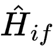
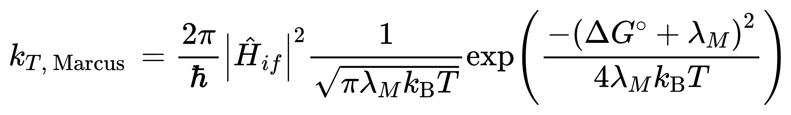
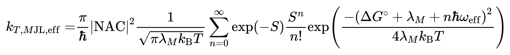

### 1. 计算优化

当计算时间过长（ ≥ 24h ）需要重新生成 gjf 文件，并修改步长
```
qcinp.py -a "opt(maxstep=2,notrust)" xxx.log
```
批量生成 orca 计算的 soc
```
for i in *tdvert.out; do echo $i; orcasoc $i; done
for i in *tdvert.out; do echo $i > SOC_${i/.out}; orcasoc $i >> SOC_${i/.out/}; done; paste SOC*
```

### 2. 计算 krisc 速率

需要三个数据：s1-t1 重组能，ΔEst，SOC

s1-t1 重组能 需要分别优化单线态和三线态结构
```
cd tdopt
cp ./*tdopt.log ./*tdopt_s1@s1.log
qcinp.py -r td -a 'td(Triplet)' -T s1@s1 -A t1@t1 *s1@s1.log
for i in *.log; do echo $i ;awk '/Total Energy/{print $5}' $i | tail -n 1; done
```
TQAOF_tdopt_s1@s1.log
-1941.20068
TQAOF_tdopt_s1@t1.log
-1941.198959
TQAOF_tdopt_t1@s1.log
-1941.221316
TQAOF_tdopt__t1@t1.log
-1941.222436

s1@t1-s1@s1=0.00172088 Hartree
t1@s1-t1@t1=0.00111961 Hartree
s1 - t1 之间的重组能为 0.07729371 eV

ΔEst = ( s1@s1 - t1@t1 )*37.2114 = 0.592001694 eV

SOC-s1-t1 = 0.01451 cm^-1

利用下面公式计算 krisc 速率

符号是 soc，是 ΔEst，为 重组能。

ℏ = h/ (2π) = 6.62607015×10^-34 J·s / 2π = 1.0545718×10^−34J⋅s




### 3. Newton-X 

[Newton-X download](https://amubox.univ-amu.fr/s/DC3FYQFFaas5K8Y)


