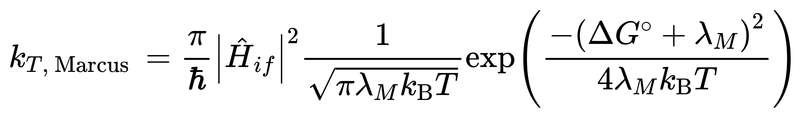

### 1. 计算优化

当计算时间过长（ ≥ 24h ）需要重新生成 gjf 文件，并修改步长
```
qcinp.py -a "opt(maxstep=2,notrust)" xxx.log
```
批量生成 orca 计算的 soc
```
for i in *tdvert.out; do echo $i; orcasoc $i; done
for i in *tdvert.out; do echo $i > SOC_${i/.out}; orcasoc $i >> SOC_${i/.out/}; done; paste SOC*
```

### 2. 计算 krisc 速率

#### 2.1 需要三个数据：s1-t1 重组能，ΔEst，SOC

s1-t1 重组能 需要分别优化单线态和三线态结构
```
cd tdopt
cp ./*tdopt.log ./*tdopt_s1@s1.log                                  # 提取 s1@s1
qcinp.py -r td -a 'td(Triplet)' -T s1@s1 -A t1@t1 *s1@s1.log        # 计算 t1@t1
qcinp.py -r 'td opt' -a 'td(Triplet)' -T s1@s1 -A t1@s1 *s1@s1.log  # 计算 t1@s1

qcinp.py -r 'td opt' -a 'td' -T t1@t1 -A s1@t1 *t1@t1.log           # 在 t1@t1 结果上计算 s1@t1

# 查看结果
for i in *.log; do echo $i ;awk '/Total Energy/{print $5}' $i | tail -n 1; done

TQAOF_tdopt_s1@s1.log
-1941.20068
TQAOF_tdopt_s1@t1.log
-1941.198959
TQAOF_tdopt_t1@s1.log
-1941.221316
TQAOF_tdopt__t1@t1.log
-1941.222436
```
#### 2.2 计算后得
```
s1@t1-s1@s1=0.00172088 Hartree
t1@s1-t1@t1=0.00111961 Hartree
s1 - t1 之间的重组能为 0.07729371 eV

ΔEst = ( s1@s1 - t1@t1 )*37.2114 = 0.592001694 eV

SOC-s1-t1 = 0.01451 cm^-1
```
#### 2.3 利用下面公式计算 krisc 速率

符号是 soc，是 ΔEst，为 重组能。

ℏ = h/ (2π) = 6.62607015×10^-34 J·s / 2π = 1.0545718×10^−34J⋅s



进阶版


使用 Python 脚本计算

```


import math

def marcus_rate(H, G, lamb, T=298.15):
    """
    计算马库斯理论中的电子转移速率常数。

    参数:
    H (float): 电子耦合常数，单位 eV。
    G (float): 标准自由能变，单位 eV。
    lamb (float): 重组能，单位 eV。
    T (float): 温度，单位 K，默认为298.15 K。

    返回:
    float: 电子转移速率常数，单位 s^-1。
    
    示例:
    >>> k_et = marcus_rate(0.1, -0.2, 0.3)
    >>> print(f"电子转移速率常数 k_et: {k_et:.3e} s^-1")
    """

    # 常数定义

    k_B = 1.380649e-23  # 玻尔兹曼常数，单位 J/K
    hbar = 1.0545718e-34  # 普朗克常数，单位 J·s
    eV_to_J = 1.60218e-19  # eV 转换为 J 的因子
    cm_to_J = 1.98644586e-23 
    # 参数转换为焦耳
    H = H * cm_to_J
    G = G * eV_to_J
    lamb = lamb * eV_to_J

    # 计算马库斯方程的各部分
    prefactor = H**2 / hbar * 2 * math.pi
    reorg_term = math.sqrt(4*math.pi * lamb * k_B * T)
    exponent = math.exp(-1* (G + lamb)**2 / (4 * lamb * k_B * T))

    # 计算电子转移速率常数 k_ET
    k_ET = prefactor / reorg_term * exponent

    return k_ET,exponent,prefactor,reorg_term

# 示例调用
k_et,exponent,prefactor,reorg_term = marcus_rate(0.1451, 0.202001694, 0.07729371)
print(f"电子转移速率常数 k_et: {k_et:.3e} s^-1 exp: {exponent:.3e} prefact:{prefactor/reorg_term:.3e}")
```


### 3. Newton-X 

[Newton-X download](https://amubox.univ-amu.fr/s/DC3FYQFFaas5K8Y)

安装参考网站 [NewtonX2.X安装方法](http://bbs.keinsci.com/thread-9782-1-1.html)


