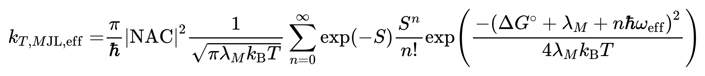

### 1. 计算更高阶的 krisc 

需要计算 Huang-Rhy 因子（参考 05-29-24-Huang-Rhys.md 的  FCclasses）:

1. 计算 s1 的 td opt freq 
2. 计算 t1 的 td(Triplet) opt freq
3. 生成 s1 的偶极子文件： gen_fcc_dipfile -i *_tdopt_freq.fchk
4. 提交  FCclasses 计算

计算得到的 Huang-Rhys 因子为状态 1 的振动分解得到的，需要对 s1 的振动的模进行列表

fcclasses.out 文件中的重组能为 t1@s1- t1@t1 （状态2）不包括 s1@t1- s1@s1（状态1）

根据进阶版公式，需 SOC/NAC、重组能/λ、ΔEst/ΔG、ω_eff、H-R-index/S


五个变量
1. SOC 计算可用 Gaussian 或者 orac 计算求得，无单位
2. 重组能/λ：为有效（低频）重组能，计算方式较为复杂， `=B3*(A3*29979245800*6.6260696E-34)*219474.6363/2625500*6.02214179E+23`，B3 列为 H-R-index，A3 列为 freq 得到的结果单位为 eV，再将 400cm-1 的结果加和，乘以 `1.98644586E-23`，单位变为 J 
3. ΔEst/ΔG：通过 Gaussian 或者 orac（双杂化）进行计算，单位需要 eV 转为 J （eV * 1.602176634E-19 = J）
4. ω_eff，使用 400 cm-1 及更高波数（高频）的 sum（H-R-index * freq） /sum（H-R-index）单位为 cm-1，乘 29979245800 cm·s-1 得到 ω_eff 单位 s-1（要和 h/2π J·s 的乘积结果为 J）
5. H-R-index/S：将 400 cm-1 及更高波数（高频）的 H-R-index 加和

五个常量
1. 派 π	3.141592654
2. 普朗克常数 h	6.63E-34 J·s
3. 温度 T	298.15 K
4. 玻尔兹曼常数 kb	1.38E-23 J/K
5. n 为从 0 到 ∞ ，在 n ≥ 25 的时候，包含 n 的一项数值为 0

将参数和公式写入到 python 脚本中：

```
#!/bin/env python
import numpy as np
import argparse
import os
import re
import math

parser = argparse.ArgumentParser(description="需要计算SOC、ΔE(st)、T 默认为 298.15 K、fcclasses.out和HuangRhys.dat")
parser.add_argument("NAC",type=float, help="SOC/NAC：cm-1")
parser.add_argument("delta",type=float, help="ΔEst/ΔG：eV")
parser.add_argument("T",nargs='?',default=298.15,type=float, help="温度：K")

args = parser.parse_args()

# 将文件名分别赋值给不同的变量
NAC_cm = args.NAC   # 变量 1 SOC
ΔG = args.delta     # 变量 2 ΔEst
T = args.T          # 变量 3 温度

# 读取文件

HRindexfile = "HuangRhys.dat"
Fccfile = "fcclasses.out"

def ReadHRindex(HRindexfile):
    print(f"reading ReadHRindex:{HRindexfile}")
    HRindex = []
    slag = 0
    # snumber = 0
    # mnumber = 0
    # RH = open(path + filename, 'r', encoding='utf8')
    RH = open(HRindexfile, 'r', encoding='utf8')
    for line in RH:
        if 'Huang-Rhys' in line:
            slag = 1
            continue
        if slag == 1 and len(line.strip().split()) ==2:
            # snumber = int(line.strip().split()[0])
            # print(snumber)
            # #line_save = line.split(' ')
            # #line_save = [string.replace('\n', '') for string in line_save]
            # # if snumber > mnumber:
            #     print(line.strip().split())
            HRindex.append(line.strip().split()[-1])
            #     mnumber = snumber
            # else:
            #     flag = 0 
    RH.close()
    return HRindex
if not os.path.isfile(HRindexfile):
    print(f"File {HRindexfile} does not exist.")
else:
    arrHRindex = np.array(ReadHRindex(HRindexfile))

def Readfreq(Fccfile):
    print(f"reading Readfcc.out:{Fccfile}")
    pattern = r'------------------------\s+FREQUENCIES \(cm-1\)\s+------------------------\s+((?:\s*\d+\s+\d+\.\d+\s*)+)\s+------------------------'
    FR = open(Fccfile, 'r', encoding='utf8')
    content = FR.read()
    matches = re.findall(pattern, content)
    all_frequencies = []
    for match in matches:
        frequencies = re.findall(r'\d+\s+(\d+\.\d+)', match)
        all_frequencies.append(frequencies)
    return all_frequencies

arrfrequencies = np.array(Readfreq(Fccfile)).astype(np.float32)

# 计算重组能/λ

Harrf = arrfrequencies[0,arrfrequencies[0]>=400]
HarrHR = arrHRindex[arrfrequencies[0]>=400].astype(np.float32)
Larrf = arrfrequencies[0,arrfrequencies[0]<400] 
LarrHR = arrHRindex[arrfrequencies[0]<400].astype(np.float32) 

λM = np.sum(LarrHR*(Larrf*29979245800*6.6260696E-34)*219474.6363/2625500*6.02214179E+23*1.98644586E-23/1.602176634E-19)

# 计算 w_eff

w_eff = np.sum(Harrf*HarrHR)/np.sum(HarrHR)

# 计算 H-R-Index

S = np.sum(HarrHR)

# 计算 krisc 方程

def marcus_rate(NAC,NAC_cm, λM, ΔG, w_eff, S, T):
    """
    计算 Marcus 速率常数
    参数:
    NAC (eV): 非绝热耦合
    λM (eV): 重组能量
    ΔG (eV): 自由能变化
    ω_eff (cm^-1): 有效振动频率
    S (无单位): Huang-Rhys 因子
    T (K): 温度

    返回:
    kT_Marcus (s^-1): Marcus 速率常数
    """
    # 常量
    h = 4.135667696e-15  # eV·s (普朗克常数)
    kb = 8.617333262145e-5  # eV/K (玻尔兹曼常数)
    ħ = h / (2 * np.pi)  # eV·s (约化普朗克常数)
    
    # 计算 Marcus 速率常数
    factor1 = (np.pi / ħ) * (NAC**2)
    factor2 = 1 / np.sqrt(np.pi * λM * kb * T)
    sum_term = 0
    for n in range(100):  # 使用有限项求和近似
        exp_term = np.exp(-S) * (S ** n) / math.factorial(n)
        exponent = -((ΔG + λM + n * ħ * w_eff * 29979245800) ** 2) / (4 * λM * kb * T)
        sum_term += exp_term * np.exp(exponent)
    
    kT_Marcus = factor1 * factor2 * sum_term
    print(factor1) 
    print(factor2) 
    print(sum_term) 
    return kT_Marcus

NAC = NAC_cm*1.239841E-4  # SOC / eV

print(f'SOC_eV: {NAC}')
print(f"λM_CM-1: {λM}")
print(f"ΔG_eV: {ΔG}")
print(f"w_eff_cm-1: {w_eff}")
print(f"H-R-Index: {S}")
print(f"K: {T}")

# 计算 Marcus 速率常数
rate_constant = marcus_rate(NAC,NAC_cm, λM, ΔG, w_eff, S, T)
print(f"Marcus 速率常数: {rate_constant:.4e} s^-1")

```

低阶的 krisc 方程有：
```
#!/bin/env python
import numpy as np
import argparse
import os
import math
import re

parser = argparse.ArgumentParser(description="需要计算SOC、ΔE(st)、T 默认为 298.15 K、fcclasses.out和HuangRhys.dat")
parser.add_argument("NAC",type=float, help="SOC/NAC：cm-1")
parser.add_argument("delta",type=float, help="ΔEst/ΔG：eV")
parser.add_argument("T",nargs='?',default=298.15,type=float, help="温度：K")

args = parser.parse_args()

# 将文件名分别赋值给不同的变量
NAC_cm = args.NAC   # 变量 1 SOC
ΔG = args.delta     # 变量 2 ΔEst
T = args.T          # 变量 3 温度

# 读取文件

HRindexfile = "HuangRhys.dat"
Fccfile = "fcclasses.out"

def ReadHRindex(HRindexfile):
    print(f"reading ReadHRindex:{HRindexfile}")
    HRindex = []
    slag = 0
    # snumber = 0
    # mnumber = 0
    # RH = open(path + filename, 'r', encoding='utf8')
    RH = open(HRindexfile, 'r', encoding='utf8')
    for line in RH:
        if 'Huang-Rhys' in line:
            slag = 1
            continue
        if slag == 1 and len(line.strip().split()) ==2:
            # snumber = int(line.strip().split()[0])
            # print(snumber)
            # #line_save = line.split(' ')
            # #line_save = [string.replace('\n', '') for string in line_save]
            # # if snumber > mnumber:
            #     print(line.strip().split())
            HRindex.append(line.strip().split()[-1])
            #     mnumber = snumber
            # else:
            #     flag = 0 
    RH.close()
    return HRindex
if not os.path.isfile(HRindexfile):
    print(f"File {HRindexfile} does not exist.")
else:
    arrHRindex = np.array(ReadHRindex(HRindexfile))

def Readfreq(Fccfile):
    print(f"reading Readfcc.out:{Fccfile}")
    pattern = r'------------------------\s+FREQUENCIES \(cm-1\)\s+------------------------\s+((?:\s*\d+\s+\d+\.\d+\s*)+)\s+------------------------'
    FR = open(Fccfile, 'r', encoding='utf8')
    content = FR.read()
    matches = re.findall(pattern, content)
    all_frequencies = []
    for match in matches:
        frequencies = re.findall(r'\d+\s+(\d+\.\d+)', match)
        all_frequencies.append(frequencies)
    return all_frequencies

arrfrequencies = np.array(Readfreq(Fccfile)).astype(np.float32)

# 计算重组能/λM

arrf = arrfrequencies[0]
arrHR = arrHRindex.astype(np.float32)

λM = np.sum(arrHR*(arrf*29979245800*6.6260696E-34)*219474.6363/2625500*6.02214179E+23*1.98644586E-23/1.602176634E-19)


def marcus_rate(NAC,NAC_cm, λM, ΔG, T):
    """
    计算 Marcus 速率常数
    参数:
    NAC (eV): 非绝热耦合
    λM (eV): 重组能量
    ΔG (eV): 自由能变化
    ω_eff (cm^-1): 有效振动频率
    S (无单位): Huang-Rhys 因子
    T (K): 温度

    返回:
    kT_Marcus (s^-1): Marcus 速率常数
    """
    # 常量
    h = 4.135667696e-15  # eV·s (普朗克常数)
    kb = 8.617333262145e-5  # eV/K (玻尔兹曼常数)
    ħ = h / (2 * np.pi)  # eV·s (约化普朗克常数)
    
    # 计算 Marcus 速率常数
    factor1 = (np.pi / ħ) * (NAC**2)
    factor2 = 1 / np.sqrt(np.pi * λM * kb * T)
    sum_term = 0
    exponent = -((ΔG + λM) ** 2) / (4 * λM * kb * T)
    sum_term =  np.exp(exponent)
    
    kT_Marcus = factor1 * factor2 * sum_term
    
    return kT_Marcus

# 示例参数
NAC = NAC_cm*1.239841E-4  # SOC / eV

print(f'SOC_eV: {NAC}')
print(f"λM_CM-1: {λM}")
print(f"ΔG_eV: {ΔG}")
print(f"K: {T}")

# 计算 Marcus 速率常数
rate_constant = marcus_rate(NAC,NAC_cm, λM, ΔG, T)
print(f"Marcus 速率常数: {rate_constant:.4e} s^-1")
```

对编写 Python 代码有了初步的认识

