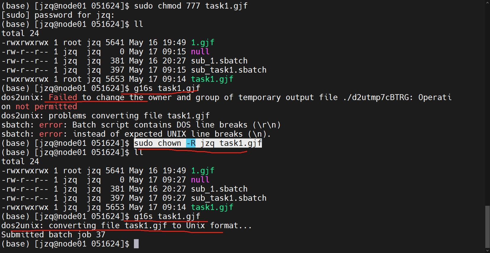

### 1. Gaussion

文件所有者 与 高斯用户不匹配
```
dos2unix: Failed to change the owner and group of temporary output file ./d2utmp7cBTRG: Operati      on not permitted
dos2unix: problems converting file task1.gjf
sbatch: error: Batch script contains DOS line breaks (\r\n)
sbatch: error: instead of expected UNIX line breaks (\n).
```

```
sudo chown -R jzq task1.gjf
```



